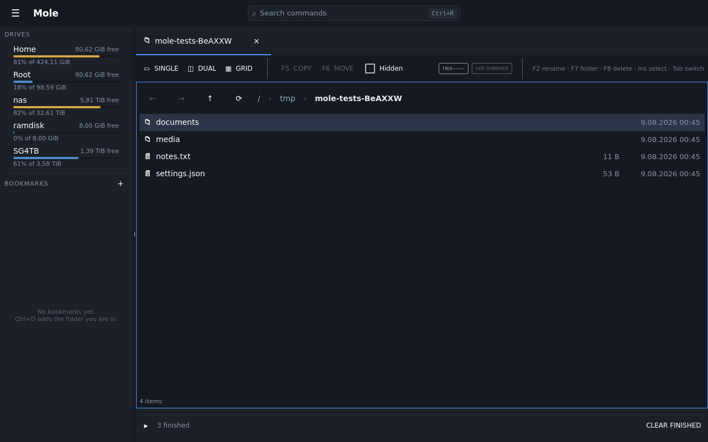

# Using Mole

An IDE, but for files. One window in which to browse, search, compare, rename in
bulk, look inside anything and run long jobs in the background — without reaching
for a terminal or a second application.

This guide describes what works today. Nothing here is aspirational: **every picture
in it was taken by the test suite immediately after asserting that the state it shows
is real**, so a screenshot cannot quietly outlive the feature it documents. If a
picture is here, something checks it.

| | |
|---|---|
| [Browsing](browsing.md) | panes, tabs, the gallery, the keyboard, folder sizes, git state |
| [Looking inside files](previews.md) | text, code, Markdown, tables, PDFs, HTML, images, databases |
| [Finding things](searching.md) | searching a tree, the indexes you have, doing something with the results |
| [Operations](operations.md) | compressing, dragging files in and out, renaming in bulk, the terminal, analysis, duplicates, sync, alerts |
| [Network drives](drives.md) | SFTP, FTP, S3, WebDAV, and the passphrase that opens them |
| [One key for everything](palette.md) | the command palette |

## Getting it running

```sh
make            # build
make run        # build and launch, keeping a log of the session
make test       # the whole suite; it is expected to be green
```

`make bundle` produces a self-contained folder in `dist/` that runs on a machine
without Qt installed.

## The shortest possible tour



A drive list on the left, tabs across the top, and a listing in the middle. The
search box in the title bar is the one thing worth learning first: **`Ctrl+R`** opens
it, and it can reach every command, bookmark and drive by typing part of its name.

## Keeping this guide honest

The pictures come from `make screenshots`, which drives the real application
headlessly and photographs each state the walkthrough test has just asserted. To
refresh them after a change:

```sh
make guide-images
```

That regenerates them and copies them into `docs/guide/images/`. A picture that
changes is a picture whose feature changed; a picture that vanishes is a test that
stopped taking it.
