# Browsing

Directories sort first, then files. The row under the cursor is what every operation
acts on when nothing is ticked — the way a commander behaves — and ticking things with
`Insert` or `Space` makes them the target instead.

## The keyboard

Nothing here needs a mouse.

| | |
|---|---|
| arrows, `Home`, `End`, `PgUp`, `PgDn` | move the cursor |
| `Enter` | open the folder, or launch the file |
| `Backspace` | up one level |
| `Insert` | tick and move on · `Space` tick · `*` invert · `Ctrl+A` all |
| `Tab` | the other pane |
| `Ctrl+T` | a new tab · `Ctrl+W` closes one · `Ctrl+1`…`9` jumps to one |
| `Ctrl+G` | type a path instead of clicking to it |
| `Ctrl+D` | bookmark this folder |
| any letter | filter the listing — no shortcut needed, and it touches no drive |

`F3` previews the file under the cursor. On a folder it opens it, because a folder has
nothing to preview and a key that does nothing is indistinguishable from one that is
broken.

## Four ways of looking at a folder

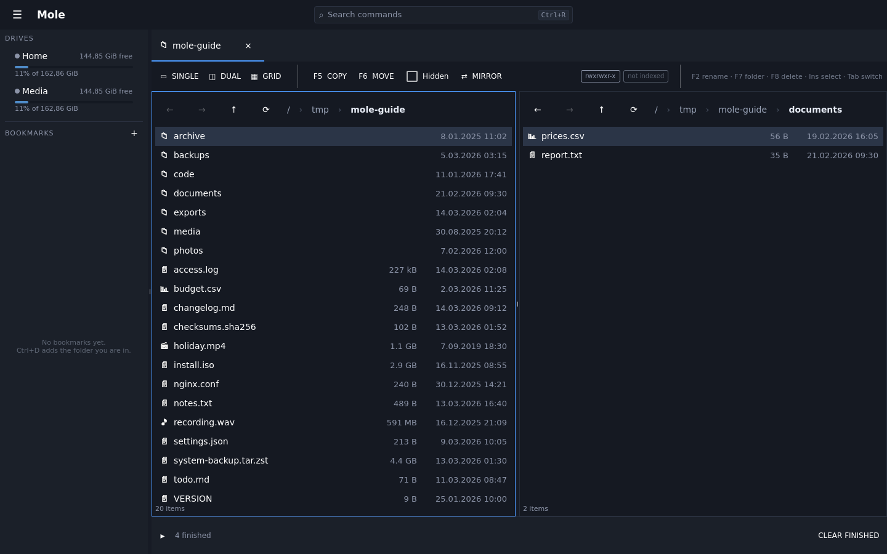

`F5` copies and `F6` moves between them, which is what two panes are for. Both refuse
politely rather than mysteriously when both sides are showing the same folder.

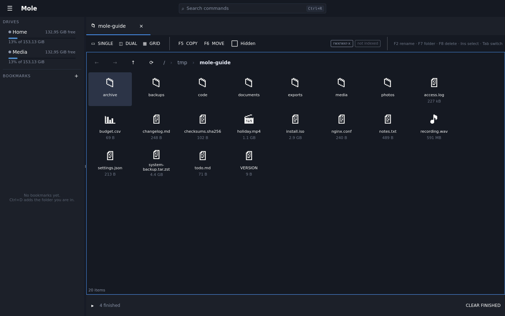

The same listing as small icons, for when a name in a column is not what you are
looking for.

### The gallery

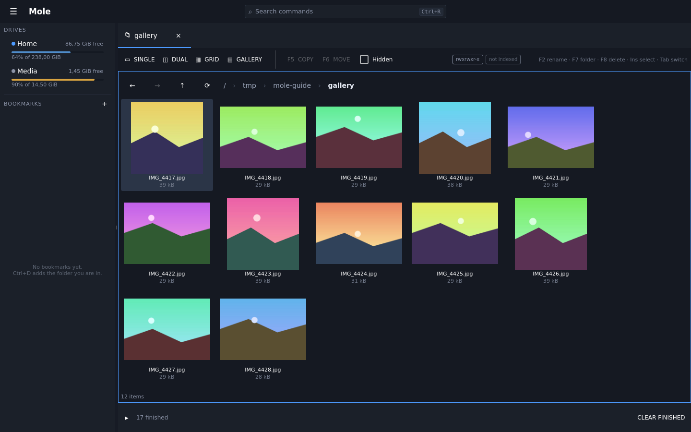

Tiles big enough to see the picture in. **It is a fourth way of looking at the same
folder, not a separate mode of working**: the same listing, the same cursor, the same
selection. Ticking with `Insert`, `F5` and `F6`, `F8`, sorting, filtering by typing and
`F3` all behave exactly as they do in the list, because it is the same pane underneath.
The arrow keys move as the tiles look — left and right by one, up and down by a row.

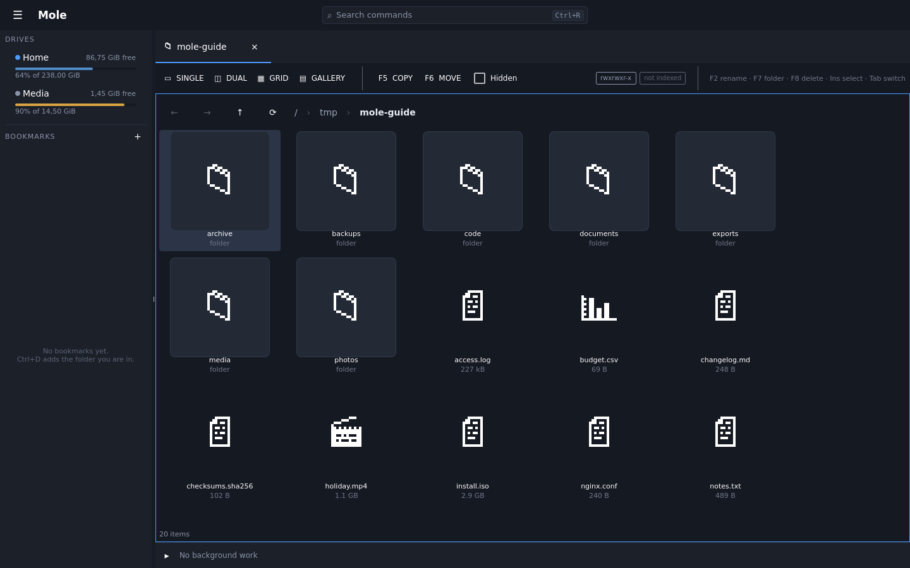

A file with nothing to show keeps its icon, drawn at a size that suits the tile, with
the name and the size under it. **An icon in the gallery never means "broken"** — it
means there is no picture to make, which is the ordinary answer for a folder of source
files, and a directory says *folder* under its name so it cannot be mistaken for a
photograph that failed to load.

Pictures, PDFs and videos have something to show. A PDF shows its first page; a video
shows a frame from a little way in rather than the first, because a great many videos
open on black and a folder of black tiles is worse than a folder of icons.

### What it costs, especially on a network drive

**Only what is on screen is made.** Scrolling fast does not queue up a folder's worth
of work, and leaving a folder takes its queue with it — so walking through five folders
does not leave the sixth waiting behind all of them. A few are made at a time, and the
tile you just scrolled to is served before one you scrolled past.

**On a drive that is not local, a photograph is not downloaded to make a tile.** Almost
every camera JPEG carries a small version of itself in its first 64 kB, and that is what
is read: a sixty-fourth of a megabyte instead of eight. It is softer than the tile, and
it tells you which picture it is, which is the whole job. A file with nothing inside it
and past a size worth fetching is left alone entirely and shows its icon — on a metered
bucket that is the difference between a few kilobytes and four gigabytes for one folder.
Locally there is no such worry, so the whole file is read and the tile is sharp.

**The pictures are cached, and the cache can be deleted.** They are kept in memory while
you scroll and on disk for the next visit, under your cache directory —
`~/.cache/Mole/Mole/thumbnails` on Linux, and `MOLE_THUMBNAILS_PATH` moves it. It is the
one thing Mole stores that holds nothing you do not already have: throwing it away costs
a few seconds of remaking tiles and nothing else. It has a ceiling and evicts what has
not been looked at for longest, so it does not grow for ever. Editing a file gets a new
tile, because a thumbnail is keyed on when the file was last changed.

## How Mole looks

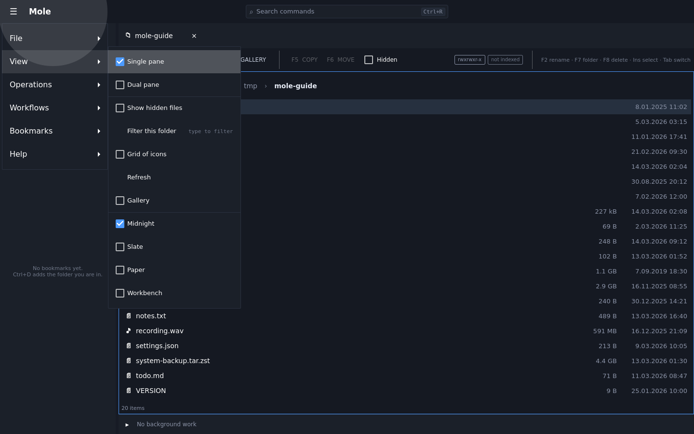

Four themes, in the **`View`** menu, with a tick against the one in force. The command
palette finds them too — `Ctrl+R`, then part of the name. The choice is remembered, so
the window comes back the way you left it.

| | |
|---|---|
| **Midnight** | dark and cool, and what Mole has always looked like |
| **Slate** | dark, a step warmer and softer, with a quieter accent |
| **Paper** | light and flat: panels and panes both white, the shell a shade off it |
| **Workbench** | light, with the chrome in a visible grey and pure white kept for the listing |

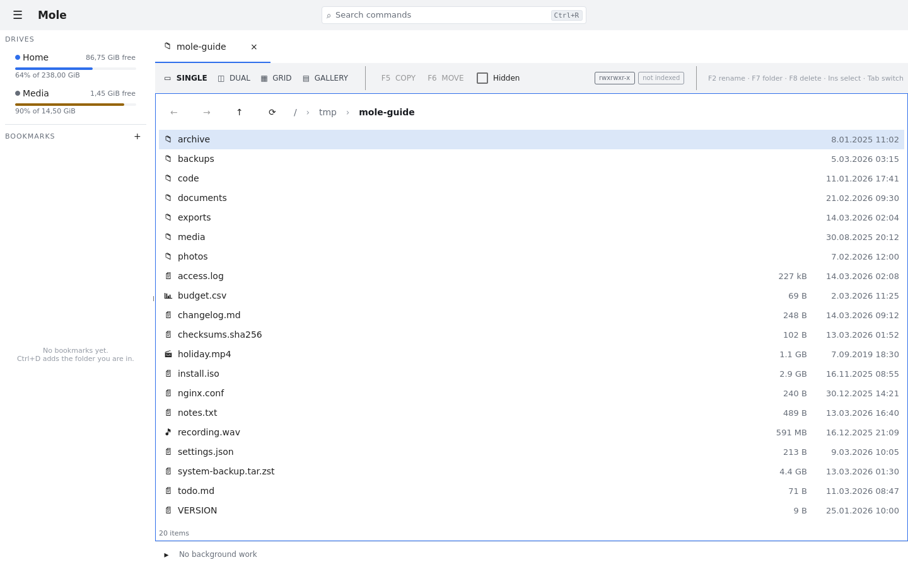

Everything follows a theme, including the things that are not the window's own paint:
source code and Markdown get a set of colours to suit a light page or a dark one, and a
file already open is re-coloured rather than left as it was. **The terminal panel stays
dark on all four**, because that is what a terminal looks like everywhere else and
because the sixteen colours a shell prints with are the terminal's rather than the
window's.

**Every picture in this guide is taken in `Midnight`.** If you are reading on `Paper` and
the screenshots do not match your window, that is the theme and not a fault.

## How big is that folder?

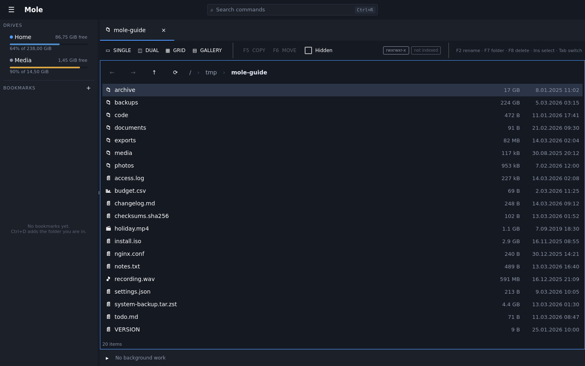

`Ctrl+Shift+S` measures the ticked folders — or every folder in the listing when
nothing is ticked — and writes each total into its row as the walk finishes it. It
runs in the background, it can be cancelled, and sorting by size then puts the measured
folders in the order you would expect.

A measurement describes the tree as it was when it was taken, so refreshing the listing
clears it. A stale number is worse than an empty cell.

## When a folder is slow

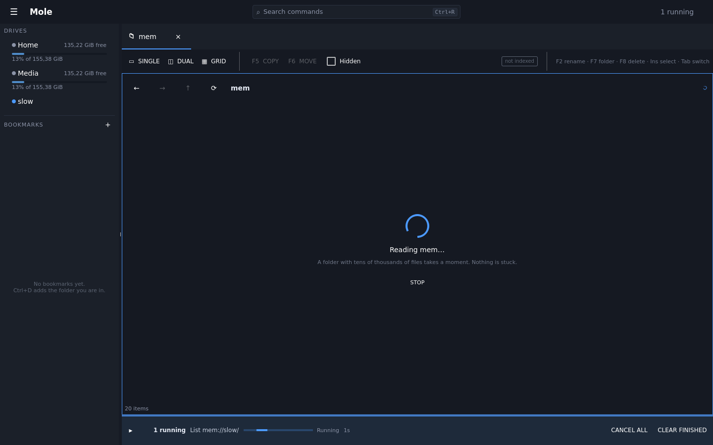

A listing that takes more than a second says so, in the middle of the pane, rather
than looking like an empty folder. Below a second it says nothing, because a spinner
that flashes is worse than no spinner at all.

## What the rows tell you

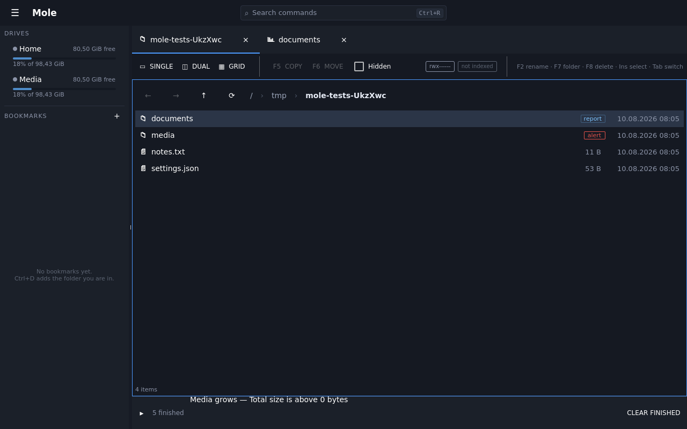

A folder that has been analysed, or that something is watching, is marked as such —
so the listing carries what is already known about a place rather than making you go
and look.

## A folder that is a git checkout

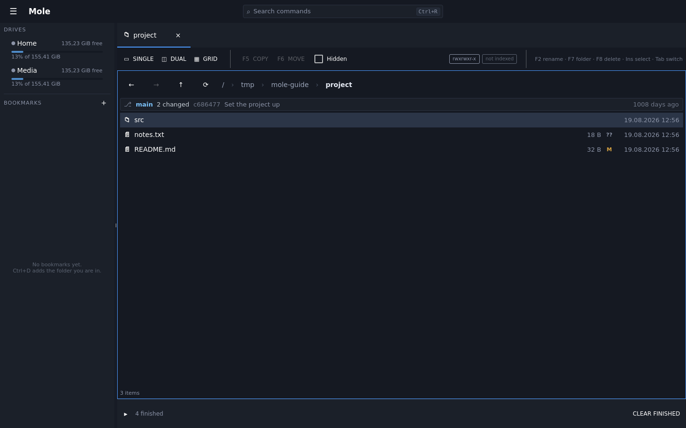

Open a folder inside a checkout and a band appears above the listing. A folder that is
not in one looks exactly as it did before — the band is absent rather than empty, so
nothing takes height off the listing to say there is nothing to say.

The band reads left to right: **which branch**, **how much has changed**, and **the
commit you are on** — its short id, its subject, and how long ago it was made. The
subject gives way first and elides; the band stays one line.

Two of those are worth spelling out.

**When git is part-way through something, the state replaces the branch** — `rebasing`,
`merging`, `cherry-picking`, `bisecting`. During any of those the branch name is either
the old one or a detached head, and both readings are wrong about what is going on. A
detached HEAD says `detached at a1b2c3d`, because an empty branch name reads as a fault
in Mole rather than as a fact about the checkout.

**`2 ahead, 1 behind` is measured against the last fetch**, not against the remote as it
is now — nothing here touches a network. A branch with no upstream configured shows no
counter at all, rather than `0 ahead, 0 behind`, which would read as up to date when the
truth is that there is nothing to compare against.

### What the letters on the rows mean

| | |
|---|---|
| `M` | changed since the last commit |
| `A` | added, and staged |
| `??` | git has never been told about it |
| `R` | renamed |
| `D` | deleted |
| `U` | conflicted — a merge or a rebase stopped here |
| `•` | a folder: something inside it has changed, however deep |

A path can be several of those at once, and the row shows the most urgent. The letter is
the signal and the colour only agrees with it, so nothing here depends on telling two
colours apart.

**Files your `.gitignore` covers carry no letter and are not counted.** They are still in
the listing — Mole shows you your files — but a build directory would otherwise bury
every real change under thousands of marks.

One thing the letters cannot show: a file git calls **deleted** has no row, because a
listing shows what is on disk. The deletion is still in the count, and the folder that
held it carries the `•`.

### Keeping up, and what it needs

The band and the letters refresh themselves. An operation you run in Mole, and a commit,
checkout or pull you run in the terminal panel or in another window, are both noticed;
a burst of writes is collected into one re-read rather than one per file. A refresh
changes the marks and never the rows, so your cursor and anything you have ticked stay
where you put them.

**Mole shows git state and does not change it.** There is no staging, committing,
checking out or fetching here, and none is planned — see
[TODO.md](../../TODO.md) for why.

**Local drives only.** libgit2 needs a real path on a real filesystem, so a checkout
reached over SFTP or in a mounted archive shows no band. And all of this needs Mole to
have been built with libgit2: without it the window behaves exactly as it did before any
of this existed, which is to say there is no band and no letters.

## Breadcrumbs

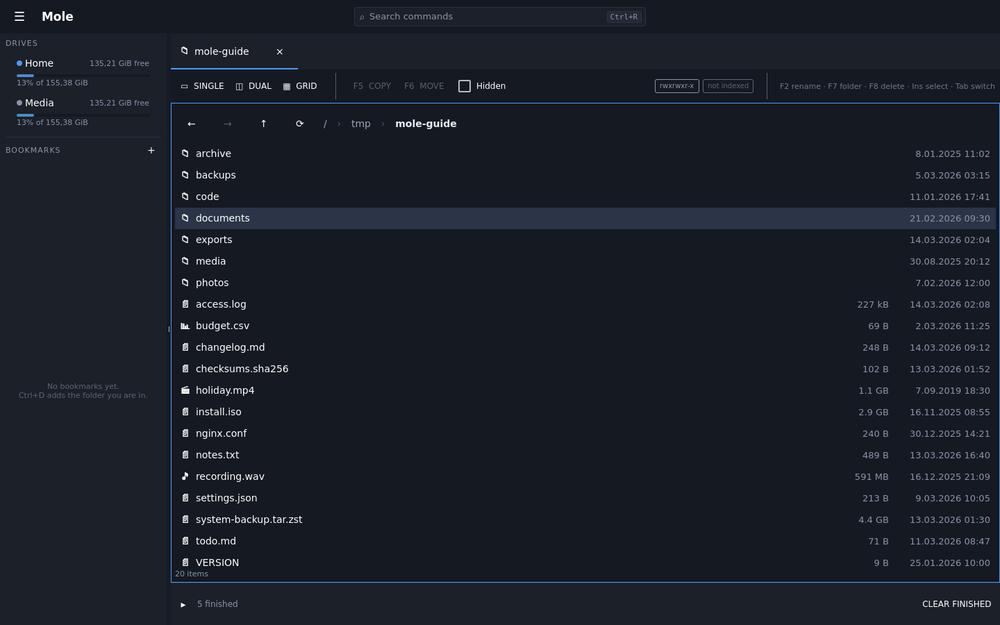

The path is clickable all the way up. `Ctrl+G` turns it into a field you can type
into, and `Ctrl+←`/`Ctrl+→` walk the history you have already been through.
