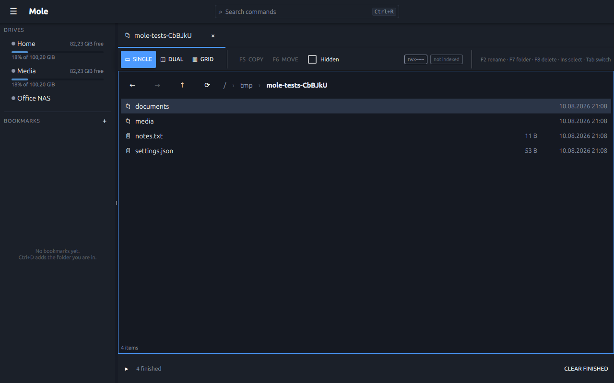
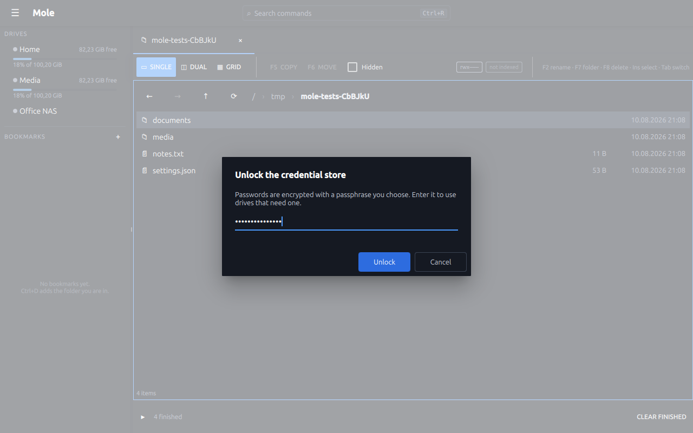
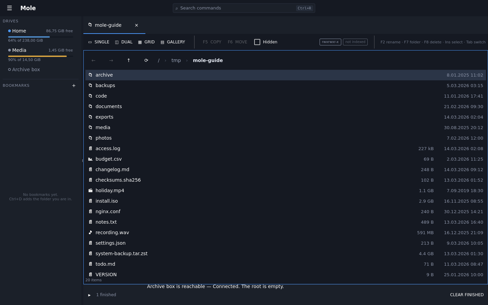
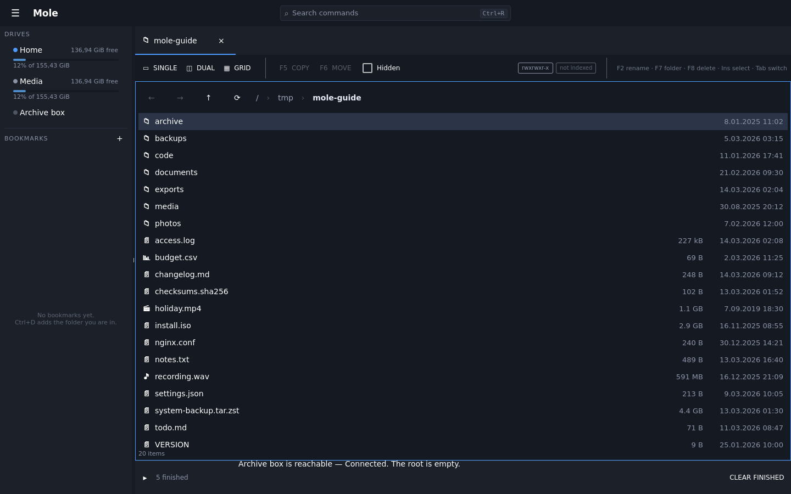

# Network drives

A drive is anywhere files live: a disk, an archive you have opened, or a server on
the other side of the network. Mole speaks **SFTP**, **FTP**, **WebDAV** and
**S3** — the last across AWS, Backblaze B2, MinIO, Ceph, Wasabi and Cloudflare
R2 — and once one is set up it is a row in the same list as everything else. The
listing, the previews, the search, copying, renaming: none of them know or care
which kind of drive they are looking at.

`F4` → File → Drives… opens the dialog above. It is where a drive is *configured*
and nothing else; connecting, ejecting and checking happen in the window.

## Adding one

Pick a kind, fill in the form, save. The forms are short on purpose — each
backend declares the fields it actually needs, so an SFTP drive asks for a host,
a user and how to authenticate, and an S3 one asks for a bucket and a key. There
is no page of eighty options, because the alternative to asking for what a
protocol needs is asking for the union of what every protocol might need.

Anything unusual sits behind **Advanced**, so the common case is four fields.

Saving also *checks* the drive — the answer to "did that work" appears next to
the form that produced it, rather than several steps later when something finally
tries to read from it.

## The passphrase

Passwords and keys are not written into the settings file. They go into a small
encrypted store, and that store is opened once with a passphrase you choose.

The part worth knowing: **the passphrase is not tied to this machine.** Nothing
about it is derived from the hardware, the user account or the installation. Back
up the configuration, take it to a fresh install, enter the same passphrase, and
the drives work. That is the whole reason it is a passphrase rather than
something the operating system keeps for you.

The settings file beside it stays readable, diffable and worth backing up — it
records *that* a field has a secret, never what the secret is.

**Nothing asks for it at startup.** The store is shut every time Mole starts, and
most sessions never touch a drive that needs it — so a drive whose password is in
there simply sits in the list, grey like the ones nobody has connected. Point at it
and its tooltip says *Locked*, and the button it offers is a key rather than a play
triangle:

**Opening it is what asks.** Click the drive and the passphrase is asked for then,
in a dialog, because that is the first moment you have a reason to answer:

Enter it and the drive connects and opens — the click you made is finished, not
thrown away. Everything else that was waiting on the store connects at the same
time, so one entry is all it ever takes. A drive marked *connect at startup* that
has no password needs nothing typed at all.

See [ADR-0031](../adr/0031-a-locked-drive-is-connected-when-it-is-opened.md) for
why it works this way, including what it used to do instead.

## Connecting, ejecting, checking

A configured drive is in the sidebar whether or not it is connected. That is the
point of it being there: the list on the left answers *what can I get at*, and a
drive that only appears once it is working answers a different and less useful
question.

The row carries a dot for what the drive is doing, and one button that connects
or ejects it. A second asks the drive whether it is actually there. All three are
in the command palette too — `Ctrl+R`, then part of the drive's name — so none of
it needs the pointer.

Connected, the row shows how full the drive is where the backend can say. Many
cannot: a bucket has no size in any useful sense, and neither does an archive. In
that case there is no bar rather than an invented number, because a bar is read
as a fact.

## What the states mean

| | |
|---|---|
| **Not connected** | set up, not connected right now. Nothing is wrong. |
| **Locked** | its password is in the store, and the store is shut. The answer is the passphrase, not a button. |
| **Connecting** | being connected, and nothing has heard back yet. |
| **Connected** | connected, and something has reached it. |
| **Unreachable** | something asked and the server did not answer. |

**Connected** and **Unreachable** are worth reading carefully, because they say
less than they look like they say.

Connecting to a drive builds the machinery to talk to it, which involves no
network traffic at all — a drive pointed at a server that has been switched off
connects exactly as successfully as one that works. So *Connected* here means
something has actually reached the far end, not merely that Mole has an object
for it. That is why connecting runs a check, and why the row sits at
*Connecting* until the check answers.

*Unreachable* means the opposite: something asked and got nothing back, at the
time shown on the row. It does **not** mean the drive has gone. The connection is
still there and the next operation may well work — what failed was a question,
and the row reports it rather than pretending to know more. An unreachable drive
can still be browsed.

Nothing polls. A drive's state changes when something is actually learned about
it — you opened it, or you pressed check — and between those moments the row
shows what was last true and when. A liveness poll would be a login attempt on
somebody else's server repeated for as long as the window is open, which is a
good way to get an address rate-limited and a small bill on a metered bucket, for
information nobody asked for.

## What is not here

**NFS and SMB are not written yet.** Both are wanted; neither exists today. On
Linux a share mounted by the operating system shows up as an ordinary drive, so
the gap is narrower in practice than it looks.

**Google Drive, Dropbox and OneDrive are not backends and are not planned as
part of the application.** Each needs OAuth, a registered application, token
refresh and a change-notification model of its own; they have almost nothing in
common with each other beyond the words "cloud storage". They belong in plugins,
which is what the drive extension point is for. The reasoning is in
[ADR-0011](../adr/0011-network-drives-without-rclone.md), which is also where the
question of why this is not a wrapper around rclone is answered.
