# Operations

The `F4` menu separates two kinds of thing, because they were once one heap and
finding anything meant reading all of it:

- **Operations** — do something to the files in front of you and hand you back to the
  listing.
- **Workflows** — open a tab that is a tool you then work in.

The question that decides which is which: does it *do something to the files*, or does
it *hand you a tool*? Anything that needs a tab of its own to be useful is a workflow.

The **File** section above them is a third thing: what you open from nothing. A browser,
a second browser, a search — the four entries that have a keyboard shortcut of their
own. Everything else is opened *onto* something, from Operations or Workflows, which is
why there is no *New Preview tab* offering a preview of no file. See
[ADR-0032](../adr/0032-a-feature-says-whether-a-new-tab-of-it-means-anything.md).

Everything in any of them is also reachable by typing — see [the palette](palette.md).

## Compressing

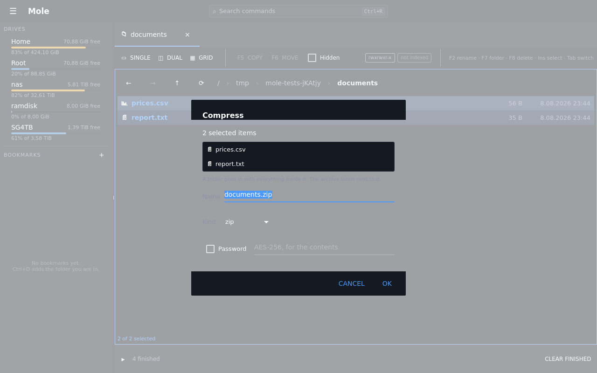

`Operations → Compress…` packs the ticked files and folders — or the row under the
cursor when nothing is ticked, and the folder you are in when there is no row at all —
into a new archive beside them. The dialog lists exactly what is going in, so it can be
checked before anything happens, and suggests a name from what is selected.

Zip, tar.gz, tar.xz, 7z, or a bare xz. Zip is the default because it is the one anyone
can open anywhere without being told how. A bare `.xz` is a single compressed stream
with no container, so it takes one file and no folders — the dialog says so rather than
failing when you press Ok.

Changing the kind changes the suffix and keeps the name you typed.

A zip can also be protected with a password, encrypted with AES-256. The box is offered
only for zip: a tar has no notion of a password, gzip and xz encrypt nothing, and the
7z writer here cannot encrypt either. Rather than accepting a password and quietly
ignoring it, those formats say why they cannot take one.

**Delete the originals when finished** does the second half of "archive this and get
it off my disk". It happens after the archive is written and closed, so there is never
a moment with the files gone and no archive; if anything could not be read the
originals are kept, because the archive is not a complete copy of them. The box is off
every time the dialog opens — archiving something once is not a standing instruction.

It runs in the background like every other job that takes time, and it can be
cancelled. A cancelled or failed compression leaves nothing behind: an archive that
exists is one that finished. One unreadable file is recorded and skipped rather than
sinking the whole archive.

It writes a new archive and nothing else — archive mounts stay read-only.

## What an operation is aimed at

Every dialog that deletes, overwrites or packs lists the files by name rather than
counting them, and the list is taken at the moment the question is asked:

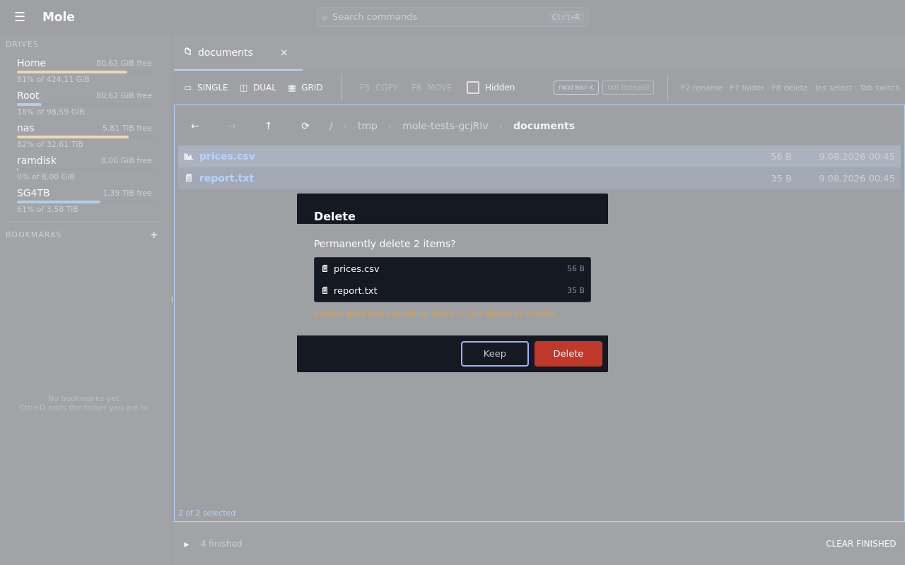

A count only confirms what you already believed. The list is there to catch the case
the dialog exists for — that ticks left over from another folder, or a cursor that is
not where you think it is, have aimed the operation at something else. Deleting
duplicates lists full locations instead of names, because inside a duplicate group
every name is the same.

## Dragging files in and out

Copying and moving have always been `F5` and `F6` between two panes. Dragging is the
other way round: it is how files get between Mole and everything else on the desktop.

**Dragging out.** Press a row and move the pointer. If the row you started on is one of
the ticked ones, the whole ticked selection goes; if it is not, that row goes on its own —
so dragging one file out of a set of ten sends one file, and finds the ten still ticked
afterwards. Dragging never moves the cursor and never ticks anything: it is not a way of
selecting.

**What leaves is always a copy.** Some applications ask for a move, and a move on this
kind of gesture is something the *receiver* performs — it takes the data and trusts the
sender to delete the original. Mole never offers that, whatever is asked for, so nothing
can leave this window by being deleted from it. The worst a misunderstood drag can do is
leave you with a duplicate. See
[ADR-0040](../adr/0040-what-leaves-the-window-is-a-path-and-it-leaves-as-a-copy.md).

**Dragging in.** Drop files onto a listing and they are copied into the folder it is
showing. While the drag is over the pane it says what would happen — how many, how much,
and into which folder, which is the thing worth checking when two panes are open:

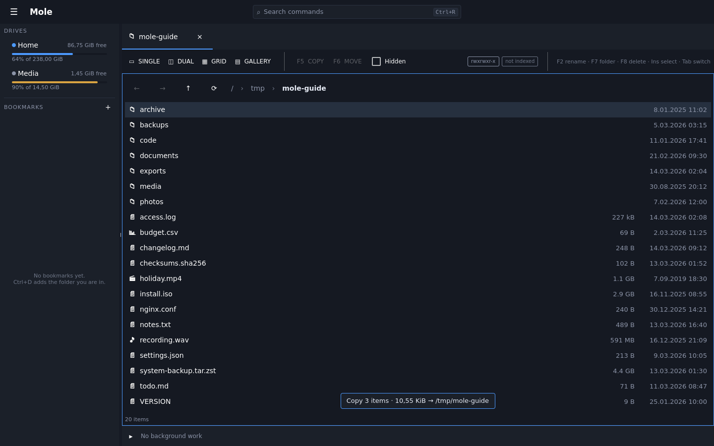

A name that is already taken opens the same confirmation `F5` uses, with the clashing
names listed and the choice between stopping, skipping that file, or overwriting it.
Nothing is written before that is answered, and stopping is the default. The pane you
drop onto becomes the active one, because that is where the files now are.

**It takes files, not addresses.** An image dragged out of a web page is a link rather
than a file, and Mole says so instead of appearing to accept it — there is nothing here
that fetches from the web, and a drop that silently does nothing reads as a fault. Drag
the file out of a folder, or save it first.

**A read-only drive does not take a drop at all.** A mounted archive cannot be written
to, so the pane showing one refuses the drag while the pointer is still moving: the
desktop shows it cannot be dropped there, and the pane says *read-only* under the
listing. Being told before letting go beats being told afterwards.

**A file that is not on this computer takes two drags.** A row inside an archive, or on
SFTP or in a bucket, has no path another application could open — so Mole fetches it into
a scratch copy first, and *that* is what leaves. The first drag starts the fetch and says
so, with the transfer in the strip along the bottom like any other; the second drag
carries the files. It works that way because a gesture cannot be paused: there is no way
to hold a drag open while a hundred megabytes come over the network, and freezing the
window until they arrived would be worse than asking for the gesture twice. Dragging the
same file again fetches nothing — the copy is reused until the original changes.

## Renaming in bulk

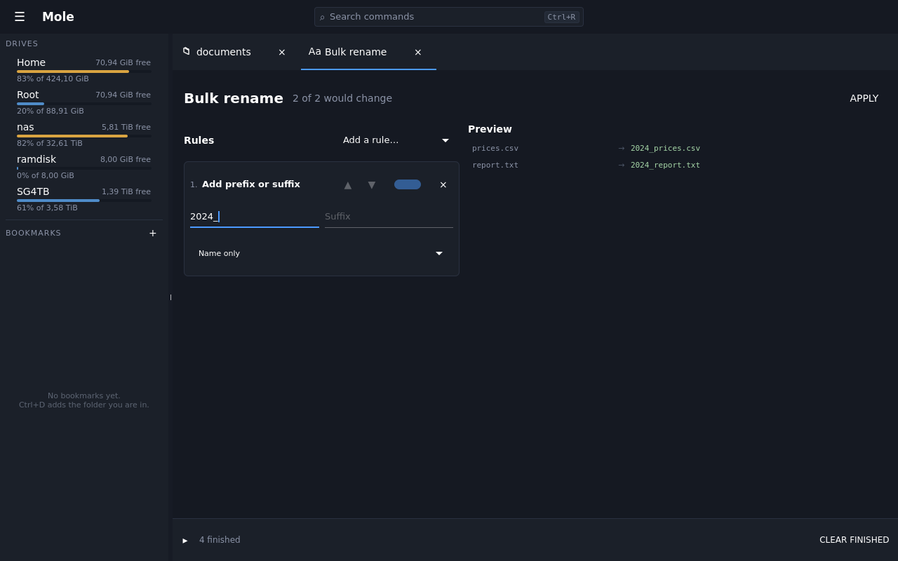

Rules on the left in the order they apply; every file's before-and-after on the right,
updating as you type. The preview is the feature: Apply refuses outright while any row
would collide, because a batch that half-succeeds is worse than one that never ran.

## A terminal, here

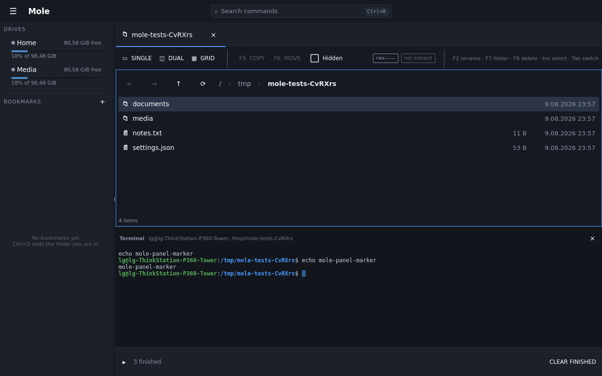

`` Ctrl+` `` opens a shell in the folder you are looking at, along the bottom. It takes
the keyboard when it opens, so you can start typing; every key goes to the shell,
including the ones the window would otherwise claim. `Ctrl+D` ends the shell and the
panel goes with it, as it does anywhere else.

Navigating afterwards does not drag the shell along — a shell has its own idea of where
it is, and fighting that is worse than leaving it alone.

## Analysing a folder

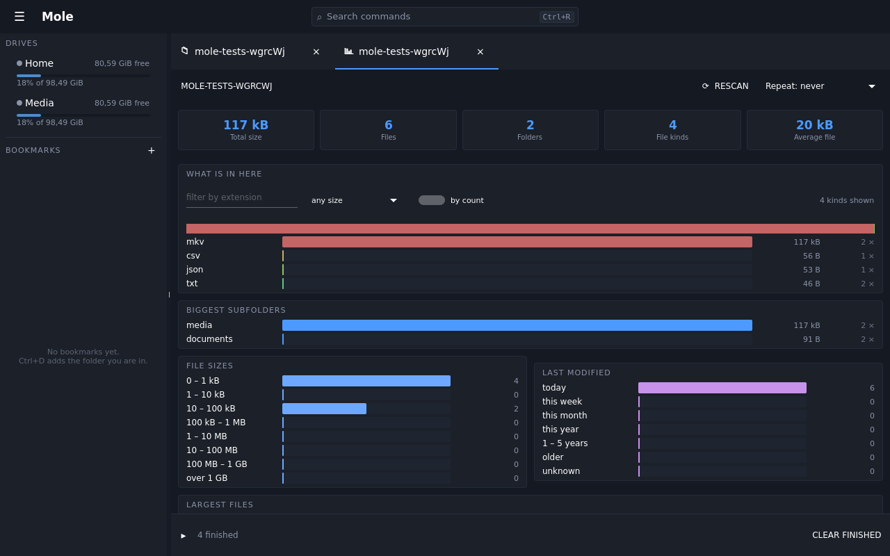

`Ctrl+Shift+A` walks a tree once and reports what is in it: what is big, what is old,
what the extensions are, which subfolder is responsible for the bulk. Reports are kept,
so two of them can be compared later and the listing marks folders that have one.

For the quick question — *which of these five folders is the big one* — use
`Ctrl+Shift+S` from [browsing](browsing.md) instead. It answers in the listing without
opening anything.

## Duplicates

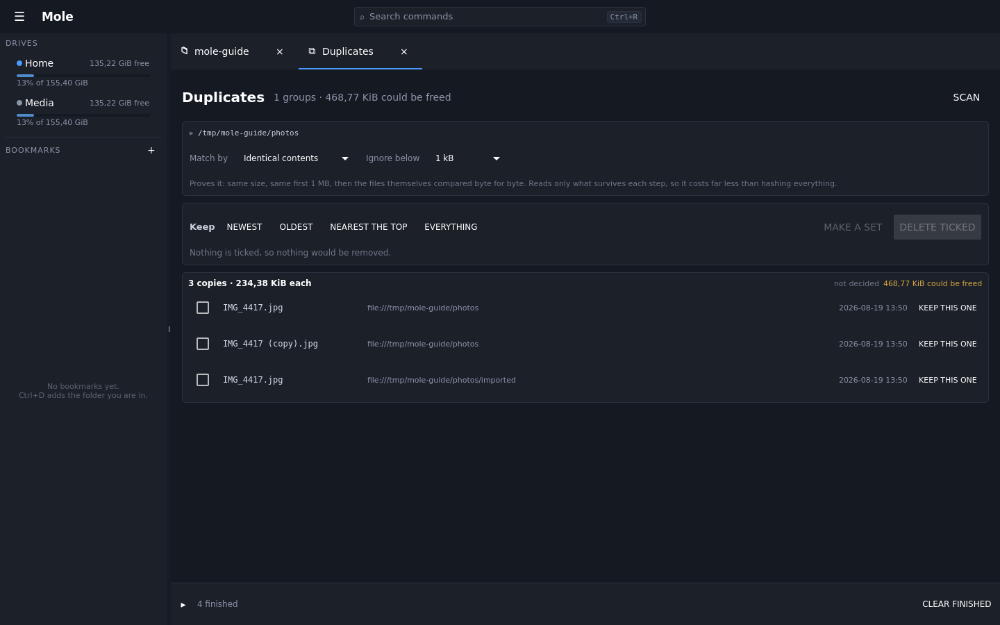

`Find duplicates` from a folder looks for files that are the same, and lets you choose
what *the same* means: identical contents, or the same size, or the same name. Identical
contents is the default and does the work in the cheapest order — same size first, then
the first megabyte, then a hash of the whole file — so almost nothing gets hashed. A
megabyte rather than a few kilobytes because a video container, a RAW photograph, a PDF
and a disk image all carry headers larger than that, and files that agree over a short
head are exactly the ones the expensive pass then has to read in full.

What comes back is groups, and they appear as the scan finds them rather than all at the
end. A group is only shown once it has agreed at every step, so nothing on the list is
ever taken back — and the biggest saving stays at the top as the rest arrive. While it is
still running the tab says which step it is on and over how many files, so a long scan on
a NAS is something you can decide to wait for.

**Stopping keeps what was found.** `Stop` leaves every group already confirmed on screen
and says the scan was stopped rather than that it finished — the rest of the tree has not
been searched, and scanning again starts from the beginning.

**Choosing what to keep.** The panel above the groups ticks a whole answer at once — keep
the newest of each group, or the oldest, or the copy nearest the top of the tree — and
then says what it did: which rule is in force, and how many copies of how many that
ticked. Every copy in a decided group reads *keeping* or *remove*, so a rule applied to
fifty groups can be checked by scrolling rather than by counting checkboxes.

A rule is a starting point, not a verdict. `Keep this one` on any row keeps that copy and
ticks the rest of its group, leaving every other group as the rule left it — and the moment
you change a tick by hand the panel stops claiming a rule is in force, because it is not.
Nothing is deleted until that is confirmed, with the files named.

Two verbs, and they mean different things on purpose. A **rule** is stated as *keep*,
because that is how the decision is made. A **tick** is stated as *remove*, because that
is what it does.

**Deleting is not the only way out.** `Make a set` turns the ticked copies into a
[file set](searching.md#sets-which-outlive-the-search), which every operation in Mole
already takes — so they can be copied,
moved, compressed, renamed or analysed instead. Operations invoked from the menu act on
the ticked copies too, exactly as they act on a selection in a pane: finding duplicates
is finding out where they are, and what to do about them is a separate decision.

## Syncing two folders

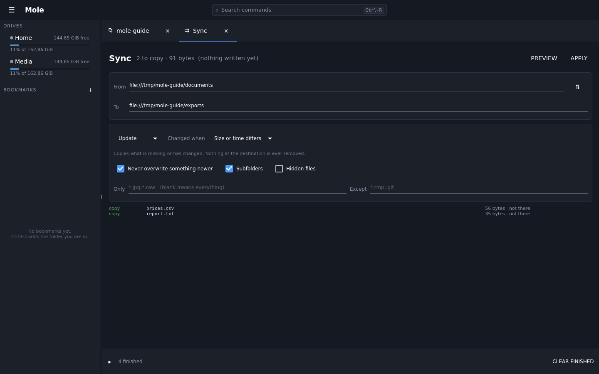

`Sync folders` makes one folder resemble another, on any two drives. It **plans first and
shows the plan**: what would be copied, what would be replaced, what would be deleted, and
what it adds up to. Nothing happens until that is agreed to, and if the plan contains
deletions the confirmation says how many and is red.

Two directions and two temperaments: *update*, which only ever adds and replaces, and
*mirror*, which also removes whatever is not on the other side. Compare by size and
timestamp, or by contents when a timestamp cannot be trusted. Include and exclude
patterns, and an option to leave a file alone when the copy on the far side is newer —
the setting that stops a sync undoing today's work.

## Alerts

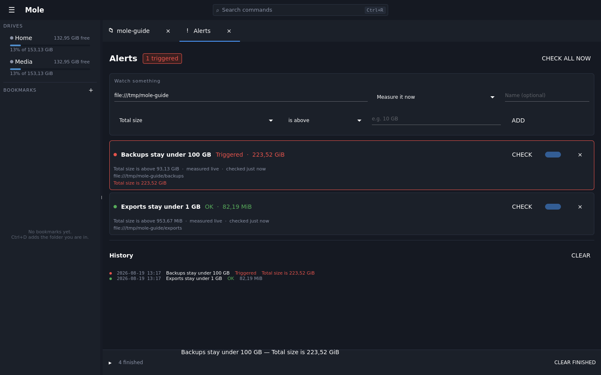

An alert is a question about a folder or a drive asked repeatedly: *is this over ten
gigabytes*, *has this stopped growing*, *has this changed at all*. Each one has a target,
a metric and a bound, and each says when it was last checked and what the answer was.

They exist because the useful version of "the disk filled up" is being told beforehand.
An alert that goes outside its bounds says so in the window rather than only in this
list, and one that comes back inside them says that too — a warning nobody is told about
is not a warning, and one that never clears is one people learn to ignore.

## Saved reports

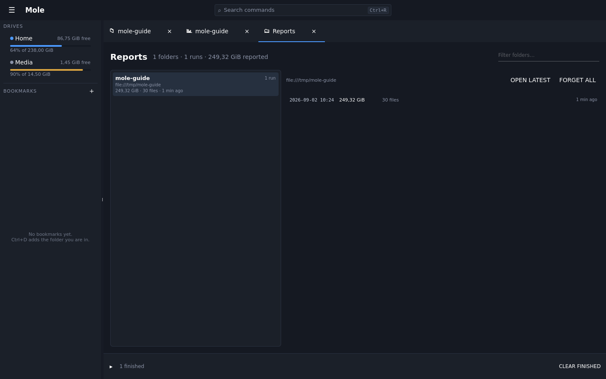

Every analysis is kept, and this is where they are. Folders on the left, that folder's
runs on the right, because a report is worth far more as a series than as a snapshot:
one says how big a folder is, several say what is happening to it. Put a report on a
repeat from the analysis itself and the series builds without anybody remembering to.

## Jobs, watching and drives

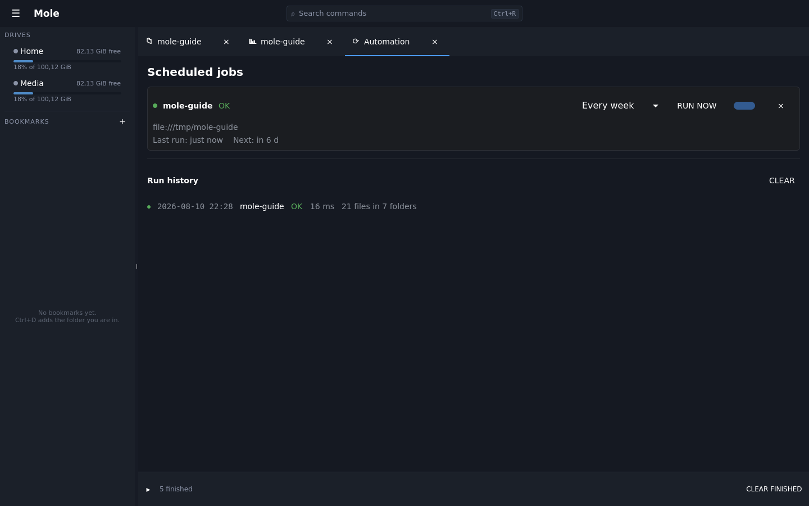

Long jobs run in the background and report in the strip along the bottom; anything that
should happen regularly can be scheduled, and anything worth being told about can be
watched.

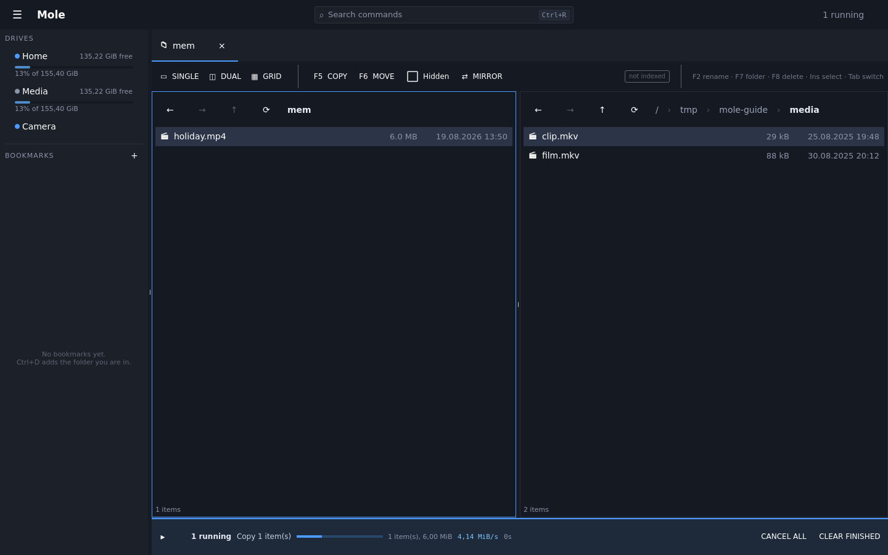

While work is going the strip carries what it is, how far along, how fast, and — once the
speed has settled enough to be worth quoting — how much longer. Everything keeps working
while it runs: the strip is a report, not a modal.

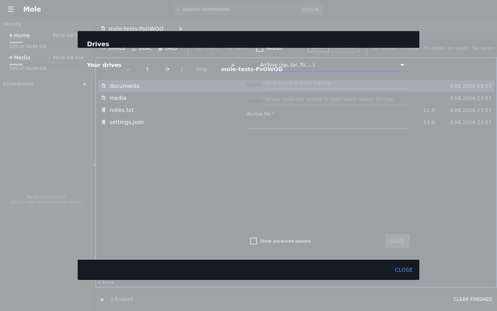

A local disk, an archive, an in-memory scratch space and a network share are all mounts
of the same interface, so every operation works the same on all of them.
