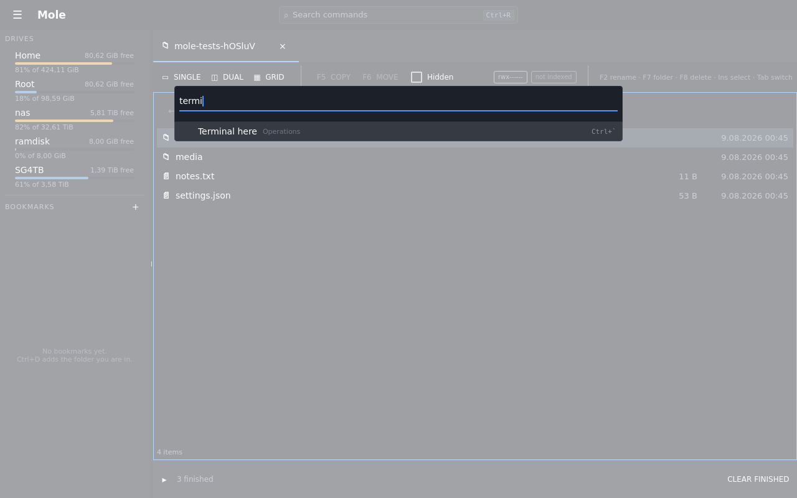

# One key for everything

`Ctrl+R` opens a box with everything that can be done right now underneath it: the
whole `F4` menu, every bookmark, every drive — so a disk or a share is reached by
typing its name rather than by finding it in the list on the left. Type part of a name and the list narrows —
`termi` leaves *Operations → Terminal here* — and `Enter` runs it.

Arrows move, `Escape` leaves, and nothing about it needs the mouse. Which is the point:
it exists because not every button deserves a keyboard shortcut of its own, so anything
that has not got one is still one phrase away.

The title bar carries a reminder of it, because a shortcut nobody has been told about is
a feature nobody has:

## What is in it

Only what can actually be done. An entry that does not apply to what you are looking at
is absent rather than greyed out — being offered something that then does nothing is
worse than not being offered it.

It holds no list of its own: the entries come from the same places the menu, the
bookmark list and the drive list come from. That is deliberate, and it is what makes it
trustworthy — a hand-maintained copy would drift out of step the first time somebody
added a command, and then the one thing this box promises would quietly stop being true.

Each row shows where it came from, so *Refresh* under **View** can be told from anything
else called the same, and the keys that already do the job are shown beside it — the
palette teaches shortcuts rather than replacing them.
