# Looking inside files

`F3` opens a preview of the file under the cursor. One tab is reused, so previewing
twenty files does not leave twenty tabs behind, and `←`/`→` step through the folder
without going back to the listing.

Whichever viewer suits the file claims it. The strip along the top says which one you
got, and offers whatever that viewer lets you choose.

## What a file is

A file's type is decided by **what is in it**, not by what it is called. When the name is
enough — `.png`, `.csv`, `.pdf` — that is the end of it. When it is not, Mole reads the
first four kilobytes and asks again:

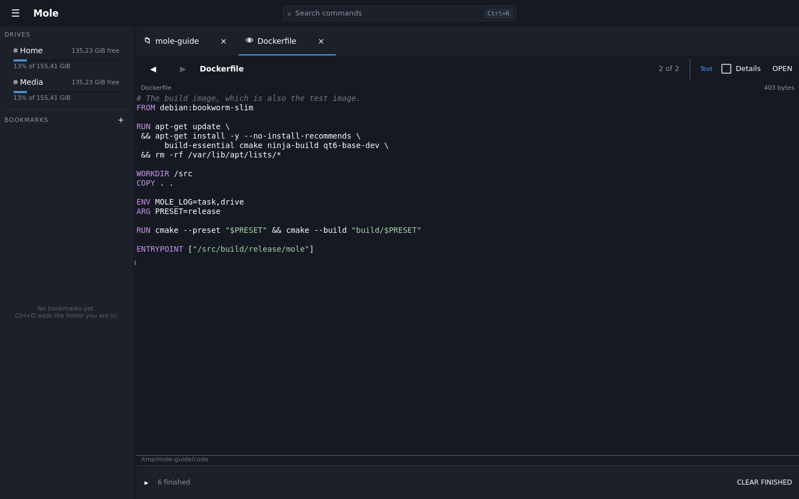

So a `Dockerfile`, a `.gitignore`, a `LICENSE` or a `.bashrc` opens as text although no
suffix says so — and where the name is itself the type, it is coloured for it: Dockerfiles,
makefiles and `CMakeLists.txt` as much as anything ending in `.py`. It works the other way
round too: a zip renamed `notes.txt` is not shown as text, because the bytes say what a file
is and the name is only a label somebody typed.

One page is read to decide, whatever the file's size, and nothing else changes: a file that
already had a viewer still gets it, and an empty file is not read at all.

## Text and code

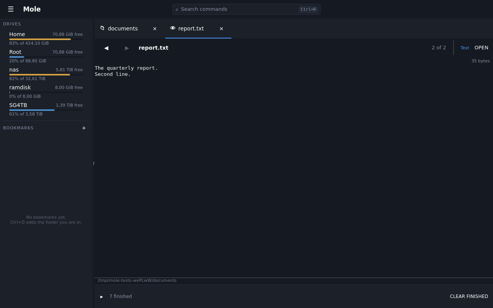

Plain text is drawn at the same size as everything else in the window, in the same
monospaced family every code and data view uses — a log or a source file is the preview
people leave open longest, so it is not the place to save a pixel.

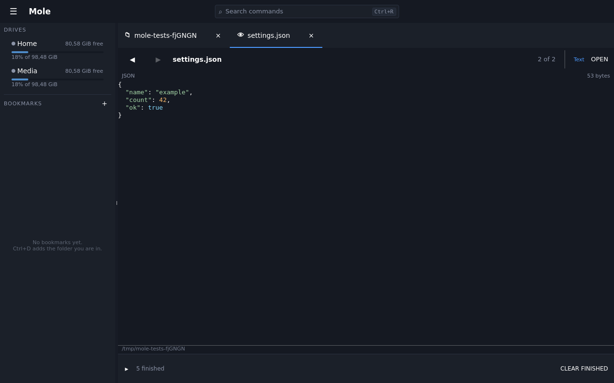

Source is coloured lexically rather than parsed, which means a half-written file, a
truncated one, or the middle of a 100 GB log still gets colour — the cases where it
helps most.

A file with no line breaks in it at all — a minified export, a one-line dump, a base64
blob — is folded into readable lengths rather than handed to the layout as a single line
half a million characters long, and the header says so: the breaks you are looking at are
Mole's, not the file's. Colouring goes off for such a window, because a fold cuts a
string in half and a half-coloured string is worse than none.

Nothing is ever read whole. Only the window on screen is fetched, so a huge log opens
as fast as a small one:

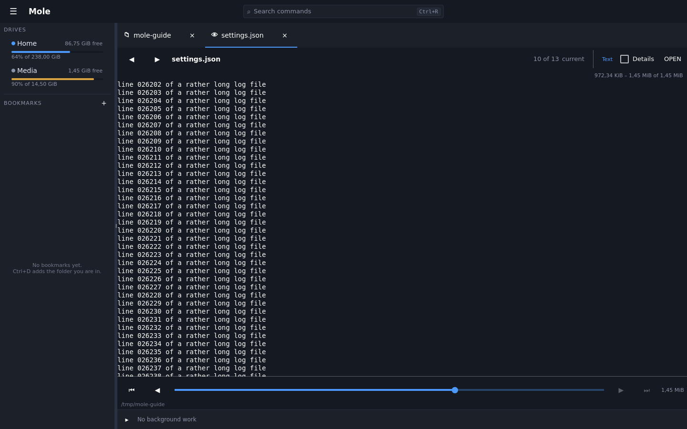

`Ctrl+PgDn`/`Ctrl+PgUp` move the window; the slider jumps to a point in the file.

## Markdown

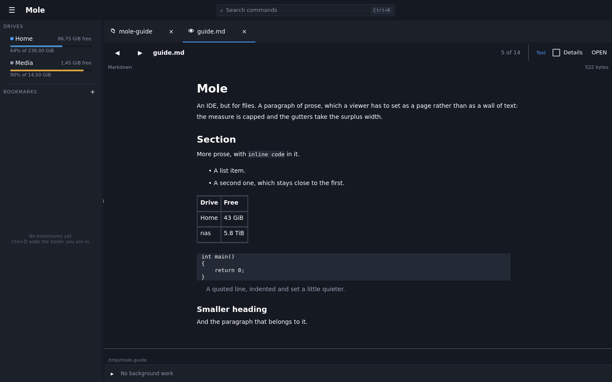

Rendered as a page rather than shown as source: headings with room around them, prose
with line spacing, code on a slab, and a capped measure with the gutters taking the
surplus so the line length stays readable on a wide window.

## HTML, either way

Sometimes you want the page and sometimes you want the source, so it is a choice rather
than a decision — and it is remembered for the next file of that type.

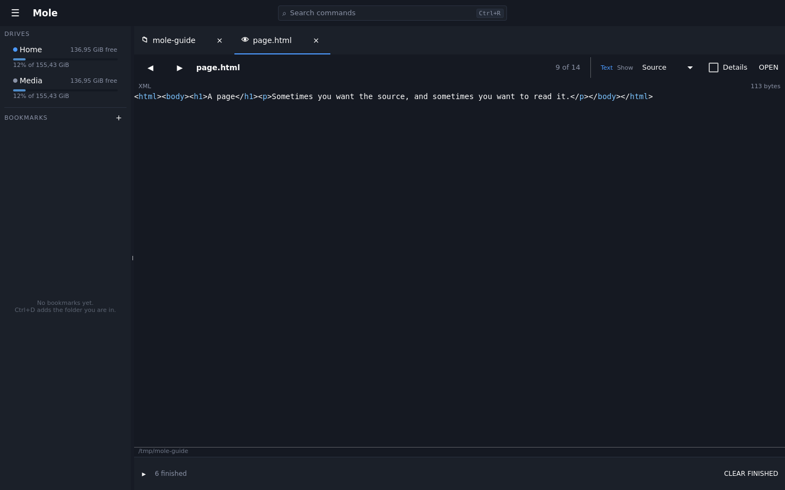
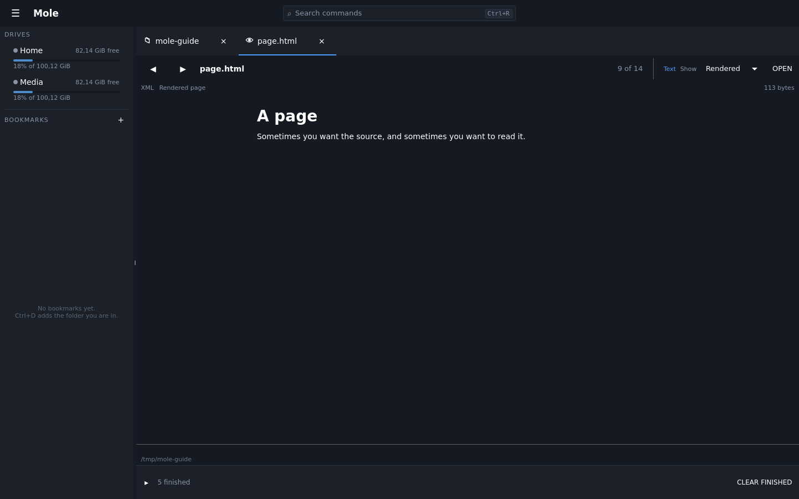

A rendered page fetches **nothing**. Images, scripts, stylesheets and frames are removed
before it is shown: previewing a file must not put anything on the network, and a page
that could report being looked at is a nasty surprise in a file manager rather than a
feature.

## Tables

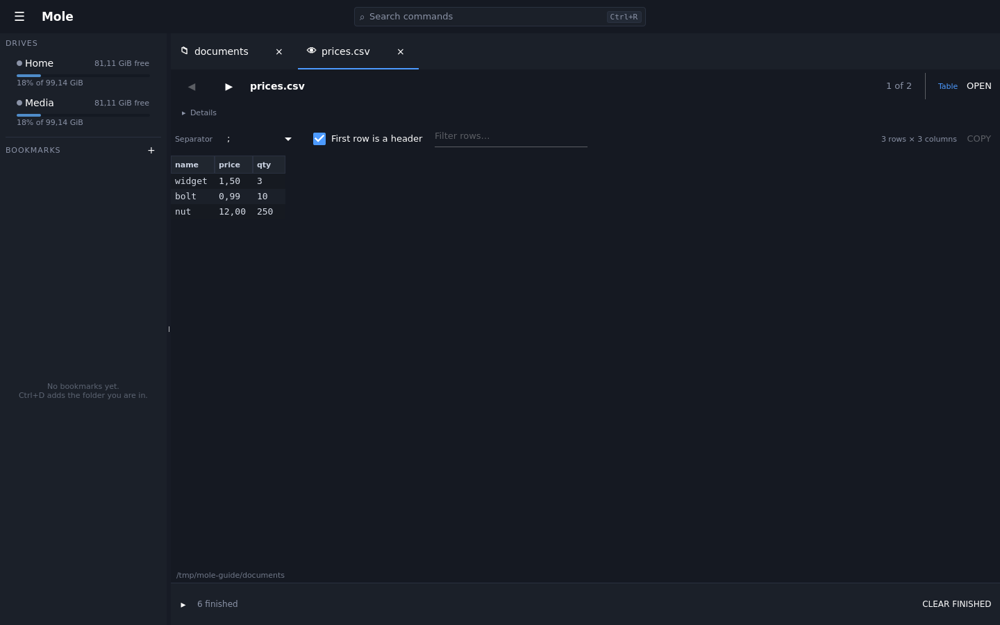

A delimited file becomes a grid backed by a scratch database rather than parsed into
memory, so nothing is left out: the filter searches the whole file, not the part that
happened to load. The separator is detected and stays editable, because detection is a
guess and you can see when it guessed wrong.

The grid shows **five thousand rows at a time**, with the controls to move between pages
under it — first, previous, next and last, which page you are on, and which rows of the
whole table are on screen. `Ctrl+PgDn` and `Ctrl+PgUp` move a page, `Ctrl+Home` and
`Ctrl+End` go to the ends; plain `PgUp` and `PgDn` move the cursor within the page. A
file that fits on one page shows no controls at all. The page is what keeps a table of
ten million rows as quick to read as one of ten: a scrollbar over the whole of it would
mean asking the file for row nine million, and every source answers that by counting to
it.

A filter is applied once you stop typing rather than on every key, because searching
every column of every row is a pass over the table and holding a key down would start
one per character.

Rows appear as they are read:

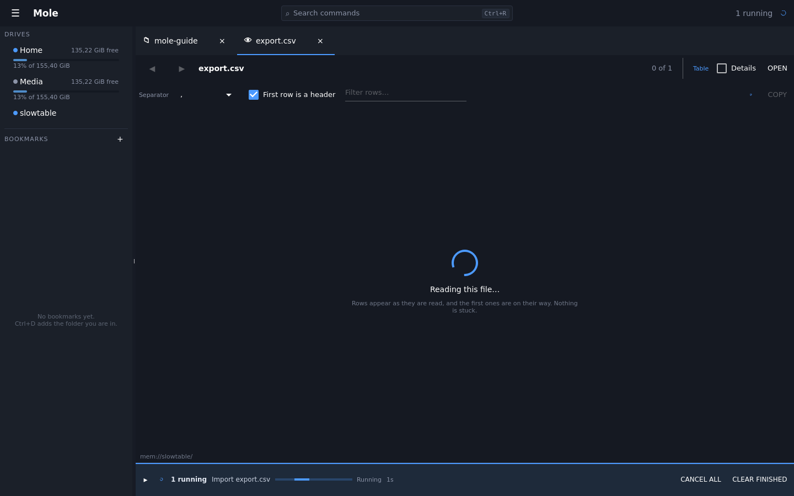

For the gap before the first rows arrive — long on a slow drive — it says it is
reading. Once rows are on screen they are the better answer to "is this working".

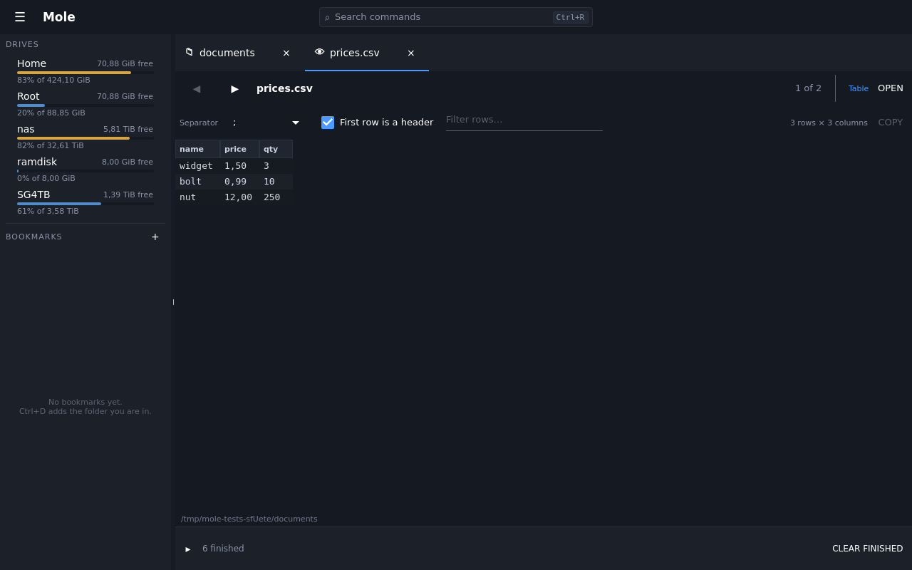

## Documents

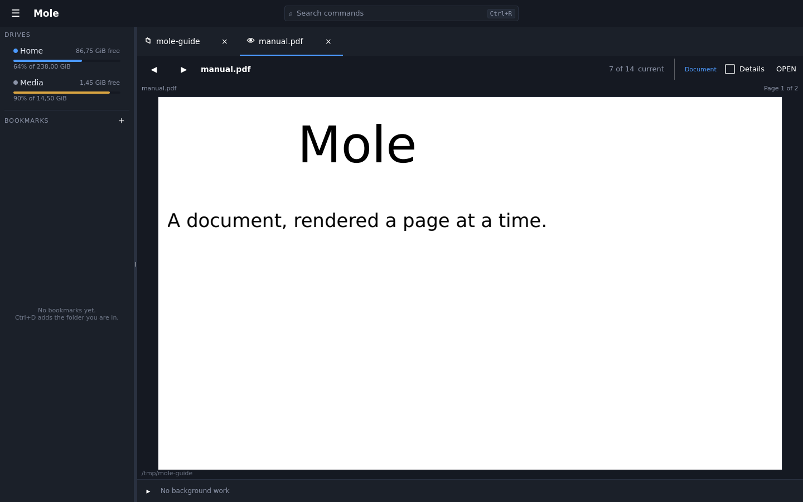

PDFs open as a column of pages, rendered one at a time as they are reached, so a
six-hundred-page scan costs the first page rather than six hundred. Read-only:
previewing a document is not a licence to modify it.

## Pictures

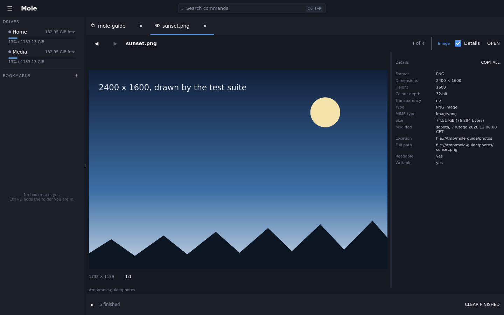

An image is fitted to the pane rather than shown at its own size, so a photograph off a
camera is looked at rather than scrolled around. Whatever Qt on this machine can decode
is claimed — png, jpeg, webp, and the rest of that list — and anything it cannot is left
to the viewer of last resort below.

## Video

A video starts playing as soon as it opens, with a pause button, a position and somewhere
to drag it to. Pressing `F3` on a video is asking what is in it, and for a video that
answer is the first few seconds rather than a still frame — the name was already in the
listing. Stepping onto the next video with `←`/`→` plays that one too, so the rule is the
same however you got to the file, and the sound comes with it.

The speaker beside the position turns the sound off, and **Mole remembers which way you
left it** — for every video, and after a restart. So a folder walked through in a quiet
room is walked through in silence, once you have said so once. There is no volume slider
and no playlist — this is for recognising a file, not for watching one.

What can be played is what this machine's codecs can decode, and that is not knowable
from the file's name: a container Mole opens may still hold a stream nothing installed
can decode. When that happens the viewer says so in words, and the details panel still
says what the file is. A build without Qt Multimedia has no video viewer at all and
shows those facts instead.

*No picture here, and that is deliberate: the guide's pictures are all taken by the same
offscreen run so that they are of the same window whatever machine took them, and that
renderer composites no video frame. A picture of this viewer would be a black rectangle,
which is the one thing it must not look like.*

## Databases

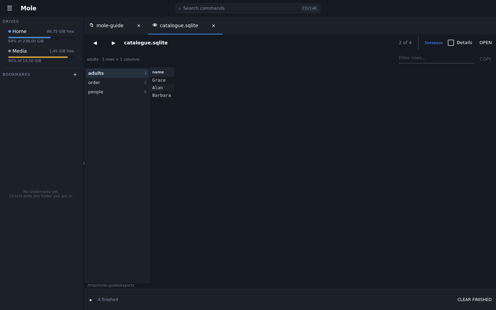

A SQLite file opens as its tables and views, one at a time, a page at a time like any
other table. The list of names appears at once and the row count beside each one fills
in behind it — counting a table means walking it, and the window is not made to wait for
that. Open **read-only**: reading a database is not a licence to write to it, which is
the same rule the PDF viewer follows.

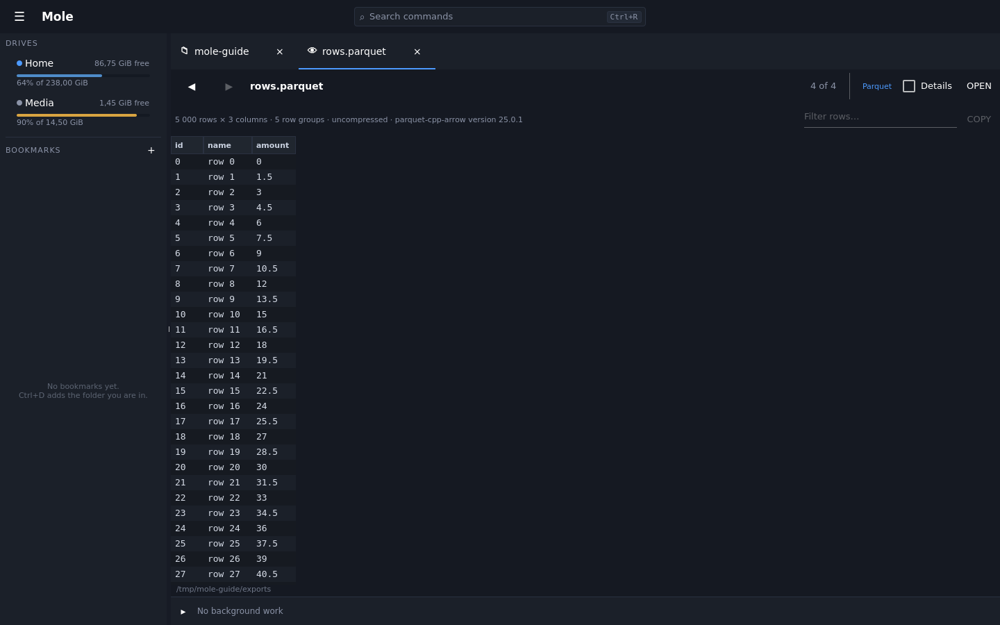

Parquet the same, when the build has Apache Arrow — it is optional, and a build without
it says so on the file rather than pretending the file is broken. Column types come from
the file's own schema, and only the row groups needed for what is on screen are read, so
a file of millions of rows opens as fast as one of ten.

## An earlier version of the file

Where the drive keeps them, the picker beside the file name moves between the states
of the file it has. It says **current** until you move it and says which version you
are on afterwards, so what is on screen is never in doubt.

Every viewer here works on one, because an earlier version is an ordinary file with
an address of its own rather than a separate kind of thing — the text viewer, the
table, the picture, all of them, read a page at a time exactly as they read the
current file. Nothing is fetched until you open the picker.

Nothing here writes: Mole shows what the drive holds and lets you copy it out. See
[What one drive can do and another cannot](drives.md#what-one-drive-can-do-and-another-cannot)
for which drives have this and why the one next to it may have nothing.

## Details

The **Details** checkbox in the strip opens a drawer beside the viewer, with one fact a
line:

- a **photograph** — its dimensions, format and colour depth, and what the camera wrote:
  the make and model, the lens, the exposure, the aperture, the ISO, the focal length, when
  it was taken, and the position if the camera recorded one
- a **document** — a PDF's title, author, page count and page size; a `.docx` or `.odt`'s
  author, who saved it last, when, and how many words
- a **video** — how long it runs, how big the picture is, the frame rate and the codecs
- an **audio file** — title, artist, album, year, track and genre, with the duration, the
  bitrate, the sample rate and the channels

The drawer is **closed until you open it**, and nothing is read for a drawer nobody opened —
so stepping through a folder of photographs stays as quick as it is. It is **one switch for
every preview**, not one per file type: where a viewer's own choices are remembered per
type, this is a choice about your screen rather than about the file. Drag the divider to
change how much room it takes; the width is remembered too.

Every value can be selected with the mouse and copied, which is the point of a fact — a
camera model or a full path is something you take out of here. **Copy all** puts every row
on the clipboard as `label: value` lines. Facts appear in the order the readers answered,
with a line between one reader's block and the next.

Reading it puts **nothing on the network**, which is the same rule a rendered page follows.
A picture's position is shown as the numbers in the file and is not looked up anywhere; a
document's properties are parsed without resolving anything the XML names. And nothing is
read whole to fill it: a header, and at most one further bounded read.

## Anything else

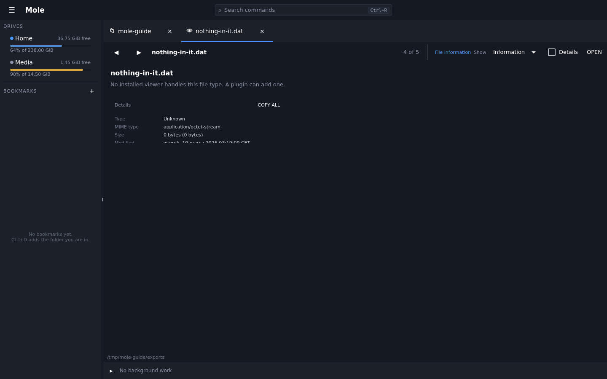

A file no viewer can show is described instead: what it is, how big it is, when it was
touched, and everything the details panel can add — a video's duration and codecs, an audio
file's tags, a document's author. "Nothing happens" is never the answer, and this is the
reason: something always claims the file, even when all it can say is what is known about
it.

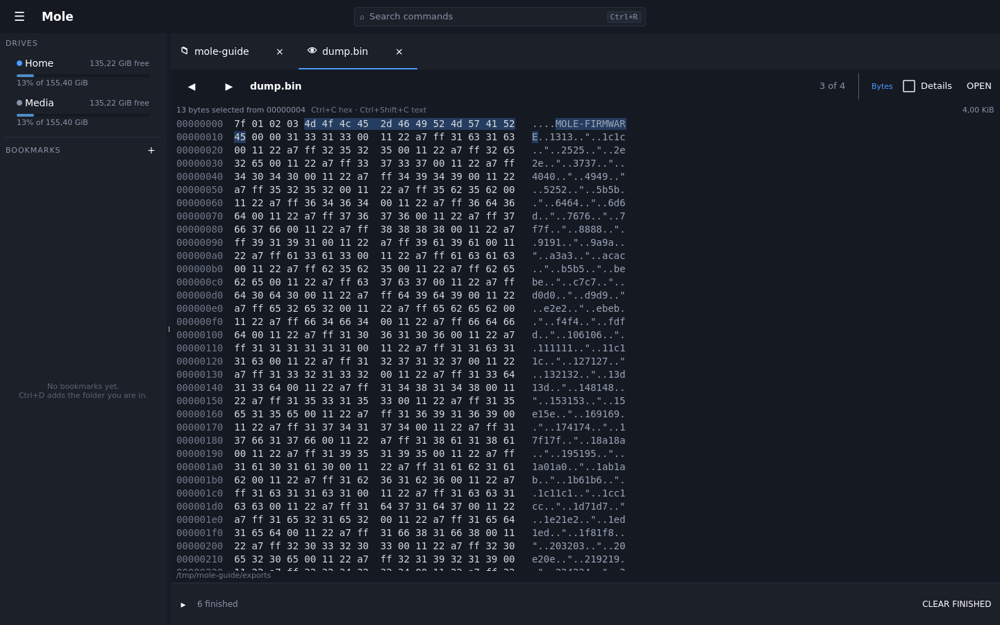

And when there is nothing to say — a format nothing here knows — what is honest to show is
what the file actually is: bytes. The offset, sixteen bytes in hex, and the same sixteen as
text with a dot for everything that has no printable form. Dragging across either column
selects a run of bytes; `Ctrl+C` copies it as hex and `Ctrl+Shift+C` as text, which is often
the whole reason for opening such a file.

The bytes are also a choice, not only a fallback: **Show: Bytes** on the strip opens this
window for any file that has no viewer of its own, and the choice is remembered for that
file type. Somebody who wants the header of an `.mp4` has it in one click; somebody who
wanted to know how long it runs is not shown hexadecimal to find out.

It is read-only, like every other preview, and windowed like the text viewer — 64 kB at a
time, with the same paging keys — so a firmware image or a 100 GB disk image opens as fast
as anything else.
