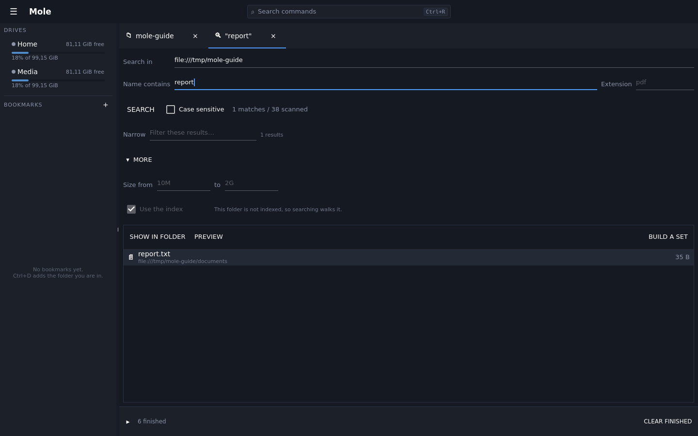
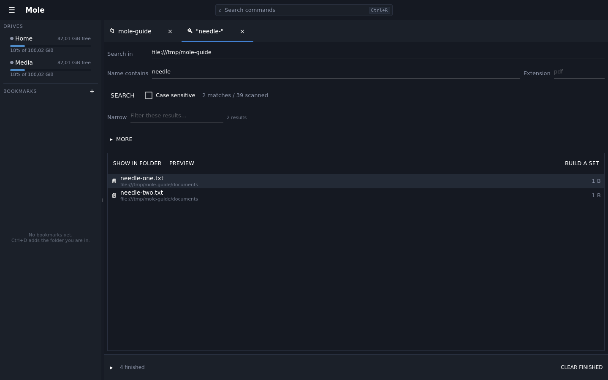
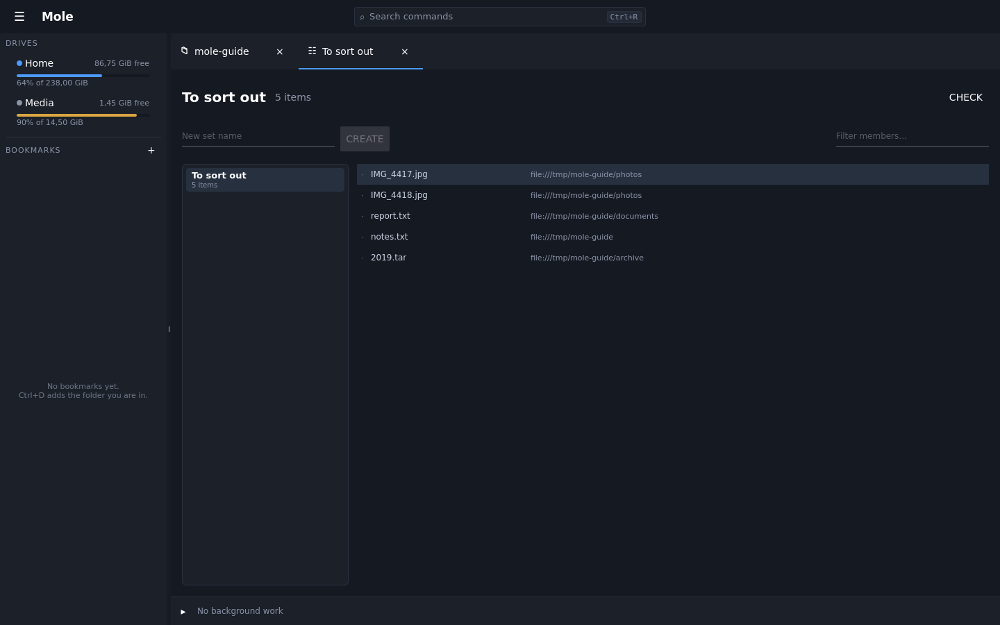

# Finding things

`Ctrl+F` opens a search over the folder you are in, with the keyboard already in the
box — reaching for the mouse to click into a search field is the thing the key exists
to save.

`Enter` starts it. While there is nothing to show yet the view says it is searching,
and matches appear as they are found rather than in one lump at the end.

## Narrowing what came back

A search over a large tree returns more than anyone wants to read, so the results can be
narrowed where they are — straight onto the matches already found, with no walk and no
second query. The count reads "3 of 41" while a filter is on.

## The other criteria

*More* folds out everything that is not needed most of the time, so the common case stays
one field and one key.

- **Time.** *Changed* takes a range, and both ends are typed the way people say them:
  `today`, `yesterday`, `this week`, `this month`, `last 7 days`, `>30d`, or a plain
  `2026-03-01`. Anything it cannot read is ignored rather than guessed at. *Made* and
  *read* are there too, where the drive reports them — most drives report only when a
  file changed, and a search by a date they do not keep finds nothing rather than
  everything.
- **What it is.** *Image*, *video*, *audio*, *document*, *archive*, *code*, *folder* —
  from what is inside the file rather than what it is called, so a `Dockerfile` is code
  and a photograph saved as `.txt` is a picture. Reading them costs something, so it is
  the last thing checked and only on what everything else has already kept.
- **Extension**, which now takes a list: `jpg, jpeg, heic`.
- **Name**, read three ways — *contains*, *matches* a shape like `report-*.pdf`, or an
  *expression*. Chosen rather than guessed at, because a file really called `a.b` is not a
  pattern. *Whole words* stops `report` matching `reporting`.
- **Path has**, which is a different question from the name and does most of the work when
  you remember the folder and not the file. *not* inverts it, as it does for the name.
- **Skip folders**, a list of names not to go into: `node_modules, .git, build`. It stops
  the walk descending rather than filtering what came back, which is the whole difference
  on a disk with source code on it.
- **Shape**: files, folders, or both; empty files; hidden files; and *this folder only*.
- **Size**, typed the way people write it — `10M`, `1.5 GiB`, `500k`, `1,5M` — where an
  empty field means no limit rather than zero.
- **Text inside**, which is the other half of a search tool: the name is what you have
  forgotten and the contents are what you remember. Literal by default, an *expression*
  when asked, and text files only unless *binary too* — decided by what is in the file
  rather than by its suffix. Each hit shows the line it was found on, with its number.

The contents are never indexed — a full-text index over a disk of files at scale is a
second disk — so a content search reads the files, and it is the last thing done: narrow
it with the criteria above and it opens only what they kept. Files past a ceiling are left
rather than read, and the line says how many. The line also counts what it opened, because
this is the one search that can take minutes and *read 340 of 1,200* is the difference
between waiting and giving up.

- **It says**, for what the files state about themselves — a camera, an author, a duration.
  These are the questions only an index can answer cheaply, so the fields offered are the
  facts that have actually been recorded for the folder you are searching. The section is
  always there: greyed with a reason where nothing has been indexed, rather than absent,
  because a field nobody can see is a capability nobody discovers.

Everything is *and*. A criterion the index cannot answer is checked afterwards rather than
dropped, and the form says which one made that happen.

Under *Search in*, one sentence says what this scope can be asked — *indexed 3 days ago,
with what the files say about themselves*, or *not indexed — names, sizes, dates and
contents only*. Asking for something the scope has no record of **stops the search** rather
than quietly widening it, because *camera = Canon* over an unindexed folder does not mean
*everything*: it means the question could not be put. Two ways out, both one click: index
this folder, or search only the part that already is — and narrowing says what it left
out.

## The index

Indexing a folder (`Operations → Index this folder`) records what is in it, and a search
over an indexed folder answers from the index instead of walking the disk. That is
enormously faster and, for a folder that was indexed, usually right.

Which is why the status line always says which engine answered and how old the index is,
and why the toggle is there: turn it off when what matters is the truth on disk right
now, whatever the index remembers. A folder that is only partly covered is walked, not
half-answered — a list where some rows are current and some are as old as the last scan
is an answer nobody can reason about.

**Where to search is a field, not a second tool.** *Search in* offers the folder you
opened the search from, a path you type, or *everywhere indexed* — every volume that has
ever been scanned, with a picker for one of them and how much is in it. `Ctrl+Shift+I`
opens the search with that scope already set, because "find this across everything I
have" is a different question from "search here" rather than a different program.
*Scan a folder…* is beside the search for the same reason: it is what makes the scope
mean anything.

## Doing something with the results

The results are a listing, not a wall: arrows move, `Enter` opens the folder holding a
match **with the cursor on it**, and `F3` previews without leaving. `Down` out of the
query box walks straight into the answers.

Above them:

- **Show in folder** — the natural end of most searches.
- **Preview** — look without leaving the results.
- **Build a set** — turn what was found into a named file set, so the work carries on
  over that set instead of ending when the tab closes. It is a snapshot of what is on
  screen, narrowing included, because those rows are what "these results" means.

## Sets, which outlive the search

A set is a named list of files that survives the tab it was made in. Building one from
results is the common route, but anything can be added to one from the Operations menu,
and the point is what happens next: a set is a target like a folder is. Analyse it,
compare it, rename across it, delete from it — the files in it may be scattered over
several drives and it makes no difference.

A set holds locations, not copies. A file that has moved or gone since is shown as
missing rather than quietly dropped, because "where did that go" is a question worth
being able to ask.
