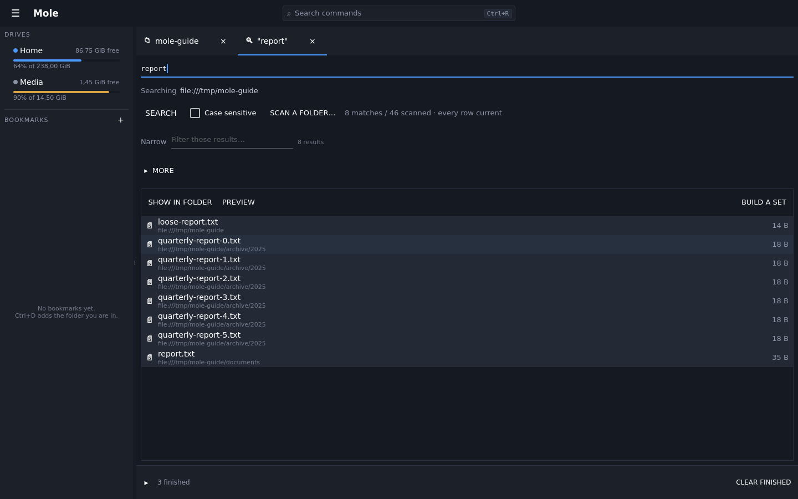
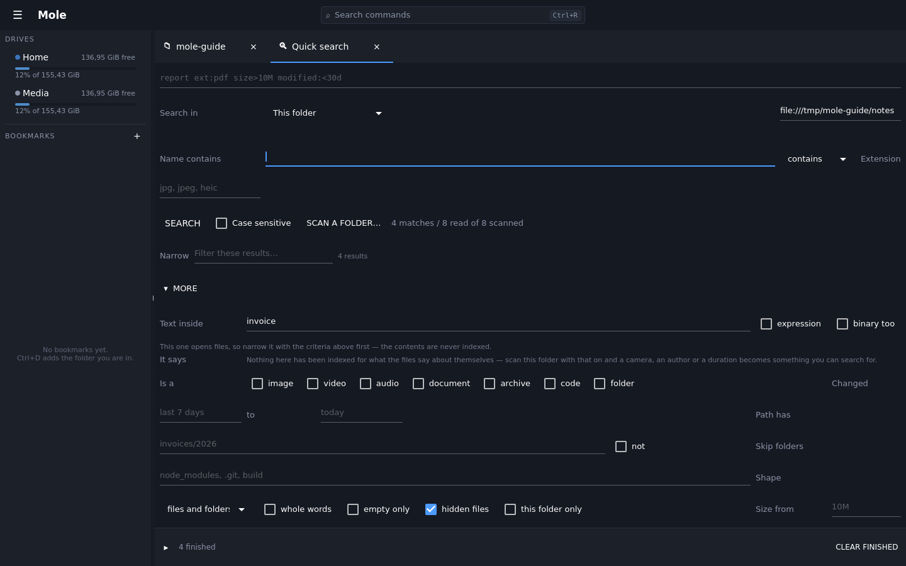

# Finding things

`Ctrl+F` opens a search over the folder you are in, with the keyboard already in the
box — reaching for the mouse to click into a search field is the thing the key exists
to save. `Enter` starts it. While there is nothing to show yet the view says it is
searching, and matches appear as they are found rather than in one lump at the end.


There is one search. Everything below is a field on it, and none of it is compulsory: a
name and `Enter` is the whole of the common case, exactly as it has always been.

A search answers four questions, and the rest of this page is those four in order.
**Where** to look. **What you know about the file.** **What is in it.** And **what about
the things that are not files** — a member of an archive is a file to everybody except a
file manager.

## Where

*Search in* offers three things:

- **This folder** and everything under it, which is where the search opened.
- **A path** you type.
- **Everywhere indexed** — every volume that has ever been scanned, with a picker for one
  of them and how much is in it. `Ctrl+Shift+I` opens the search with this scope already
  set, because *find this across everything I have* is a different question from *search
  here* rather than a different program.

Under it, one sentence says what this scope can be asked:

| It says | It means |
|---|---|
| *not indexed — names, sizes, dates and contents only* | nothing has been scanned here. Everything that does not need an index still works. |
| *indexed 3 days ago, names only* | scanned, but without collecting what the files say about themselves. |
| *indexed 3 days ago, with what the files say about themselves* | scanned in full: cameras, authors and durations can be asked for. |
| *part of this folder is indexed, …; the rest is walked* | the ordinary case — see below. |

### A folder whose subfolder was indexed

This is the normal shape, because people index the big slow tree and not the disk it sits
on. Searching the folder above it uses both: the indexed part answers **instantly**, and
the walk covers the rest and keeps going.

The rows say which. A result that came from a scan carries a quiet ○ and, in its tooltip,
when that scan ran. As the walk reaches each path the row is replaced by what is actually
on disk and the mark goes; once the walk has listed a folder, anything the index claimed
there and the walk did not find is **taken back** — deleted since the scan, or no longer
matching. So the list starts useful and converges on the truth while you read it, and the
status line accounts for both halves until it can say *every row current*.



Nothing anywhere decides an index is "too old" to use. A folder that changes often is one
you index often, or do not index at all and search directly — which is why the schedule
below is the control that matters.

## What you know about the file

*More* folds out everything that is not needed most of the time.

- **Name**, read three ways — *contains*, *matches* a shape like `report-*.pdf`, or an
  *expression*. Chosen rather than guessed at, because a file really called `a.b` is not a
  pattern. *Whole words* stops `report` matching `reporting`.
- **Time.** *Changed* takes a range, and both ends are typed the way people say them:
  `today`, `yesterday`, `this week`, `this month`, `last 7 days`, `>30d`, or a plain
  `2026-03-01`. Anything it cannot read is ignored rather than guessed at. *Made* and
  *read* are there too, where the drive reports them — most drives report only when a file
  changed, and a search by a date they do not keep finds nothing rather than everything.
- **What it is.** *Image*, *video*, *audio*, *document*, *archive*, *code*, *folder* — a
  class rather than an extension, taken from what is inside the file. So a `Dockerfile` is
  code although it has no suffix, and a photograph saved as `.txt` is a picture although it
  claims otherwise. Extensions are how a file is stored; a class is how anybody thinks
  about it.
- **Extension**, which takes a list: `jpg, jpeg, heic`.
- **Path has**, a different question from the name, and the one that does the work when you
  remember the folder and not the file. *not* inverts it, as it does for the name.
- **Skip folders**: `node_modules, .git, build`. It stops the walk descending rather than
  filtering what came back, which is the whole difference on a disk with source code on it.
- **Shape**: files, folders, or both; empty files; hidden files; and *this folder only*.
- **Size**, typed the way people write it — `10M`, `1.5 GiB`, `500k`, `1,5M` — where an
  empty field means no limit rather than zero.
- **It says**, for what the files state about themselves — a camera, an author, a duration.
  See *Metadata* below.

Everything is *and*. A criterion the index cannot answer is checked afterwards rather than
dropped, and the form says which one made that happen.

### When the scope cannot answer

Asking for a camera over a folder nothing has recorded one for **stops the search**. That
question does not mean *everything*; it means it could not be put, and quietly widening it
is how somebody comes to distrust the whole thing. Two ways out, both one click: *index
this folder*, or *search only the indexed part* — and narrowing says what it has left out.

The section is never hidden, only greyed with a reason, because a field nobody can see is a
capability nobody discovers.

## What is in it

**Text inside** searches the contents of the files themselves. Literal by default, an
*expression* when asked, and text files only unless *binary too* — decided by what is in
the file rather than by its suffix, so a program named `.txt` is skipped and a note named
`.dat` is searched. Each hit shows the line it was found on, with its number.

This is the slow one, and it is slow for a reason worth knowing: **the contents are never
indexed**, so it reads the files. That makes narrowing the other criteria first the
difference between seconds and minutes — *PDFs, changed this month, containing "invoice"*
opens only the PDFs changed this month. The line counts what it has opened as well as what
it has found, because this is the search that can take minutes and *read 340 of 1,200* is
the difference between waiting and giving up. Files past a ceiling are left rather than
read, and the line says how many.



## Archives

A scan of a local drive also lists what is inside the zips, tarballs and 7z files it meets,
so `report.pdf` inside `backup.zip` is found by name like anything else. The row says which
archive it came out of, and opening it mounts that archive and lands on the file — which is
what opening a `.zip` from a listing has always done. A content search reaches inside too.

The bounds are deliberate. An archive inside an archive is a row and is not opened, because
following one is a recursion with no floor. A container that gives up more entries than the
ceiling contributes the ceiling and says so on its own row. On a drive that is not local,
listing an archive means fetching it, so large ones are left alone. A corrupt or
password-locked archive costs its own rows and never the scan.

## Metadata, and why the contents are not indexed

Indexing a folder can also record what each file says about itself: `image.camera`,
`image.iso`, `image.taken`, `doc.author`, `doc.pages`, `media.duration`, `audio.artist`.
That is what makes *the photographs I took with that camera* and *the videos longer than an
hour* answerable at all — not slowly, but at all.

**And it is exactly why the contents are not indexed.** A camera, a lens, an exposure and a
date taken are a few dozen bytes. The photograph is eight megabytes. An index of what a
file *says about itself* is a small fraction of a disk and worth keeping beside it; an index
of what is *in* the files is the disk again, and stops being a catalogue that sits beside
your files and starts being a second copy of them. So one is recorded and searched
instantly, and the other is read when you ask for it. That is one position rather than two.

The facts come from the same readers that fill a preview's *Details* panel, so the index
and the panel can never tell you different things. Which fields the form offers follows
what has actually been recorded for the folder you are searching — a plugin that records a
new fact gets a field without anybody editing the form, and a fact nothing in scope carries
is not offered.

## Indexing, and keeping it fresh

*Scan a folder…* sits beside the search, because it is what makes any of the above mean
anything. It walks the tree once in the background and records it; searching that folder
afterwards never touches the disk. Two switches, both with their cost stated: recording
what the files say about themselves is one read per file, and listing what is inside
archives is one read for a zip and a whole pass for a `tar.gz`.

A re-scan **keeps what has not changed**. A folder whose modification time has not moved
has the same contents, so its subtree is carried across rather than walked again — which on
the trees this exists for is the difference between minutes and hours to learn that nothing
much has moved. Nothing is ever carried forward that the scan did not just see in its
parent's listing, which is why a folder that has been deleted disappears rather than
lingering. A drive that does not date its folders gives the scan nothing to work from, so
it walks the lot and says so, and *Full rescan* walks everything and keeps nothing — which
is what to reach for when you suspect the index.

*Keep it up to date* puts the folder on the same clock every other repeating job in Mole
uses — every hour through to every month, and *never* to take it off again. It survives a
restart and catches up on a run missed while the machine was off, and choosing a different
interval for a folder that is already on one changes it.

**The index can be deleted without losing anything but time.** It holds nothing that is not
already in your files; throwing it away costs a rescan and nothing else.

## Typing the whole thing

Above the form is a line, and the two are one query seen twice: typing here moves the
fields, and changing a field rewrites this. Neither is the master — the line teaches the
form's vocabulary to somebody who started with the mouse, and the form explains the line to
somebody who started by typing.

```
report ext:pdf size>10M modified:<30d
holiday type:image image.camera:"X100V" image.iso>800
ext:cpp,h content:"TODO(perf)"
name:/^IMG_\d{4}/ -path:node_modules
```

Bare words are a name substring, as they are in every search box. `key:value`, with `>`,
`<`, `>=` and `<=` for anything numeric or dated. A `-` in front negates. Quotes hold a
space, commas hold a list, and `/…/` holds a regular expression — the one place a pattern
is guessed at, and why the name field has a mode of its own. The metadata keys are keys
like any other, so the vocabulary is one thing rather than two.

Everything is *and*: no *or*, no brackets and no precedence to learn, which is a decision
rather than an omission. A line nobody can read says what is wrong and does not run —
`size>10Q` is a complaint with the offending word marked, and `extn:pdf` asks whether you
meant `ext`, because a typo that quietly searched names is how somebody spends ten minutes
doubting their disk.

The line can be left empty and the form used on its own.

## Narrowing what came back

A search over a large tree returns more than anyone wants to read, so the results can be
narrowed where they are — straight onto the matches already found, with no walk and no
second query. The count reads "3 of 41" while a filter is on.

## Doing something with the results


The results are a listing, not a wall: arrows move, `Enter` opens the folder holding a
match **with the cursor on it**, and `F3` previews without leaving. `Down` out of the query
box walks straight into the answers.

Examining twenty results leaves **one** browser tab, not twenty: the first reveal opens one
and every reveal after it moves that same tab. The search stays where it was — its results,
its narrowing and its scroll position — and the tab that opened carries a line back to it,
so being three folders deep is not a puzzle.

Above them:

- **Show in folder** — the natural end of most searches.
- **Preview** — look without leaving the results.
- **Build a set** — turn what was found into a named file set, so the work carries on
  over that set instead of ending when the tab closes. It is a snapshot of what is on
  screen, narrowing included, because those rows are what "these results" means.

## Sets, which outlive the search


A set is a named list of files that survives the tab it was made in. Building one from
results is the common route, but anything can be added to one from the Operations menu,
and the point is what happens next: a set is a target like a folder is. Analyse it,
compare it, rename across it, delete from it — the files in it may be scattered over
several drives and it makes no difference.

A set holds locations, not copies. A file that has moved or gone since is shown as
missing rather than quietly dropped, because "where did that go" is a question worth
being able to ask.
